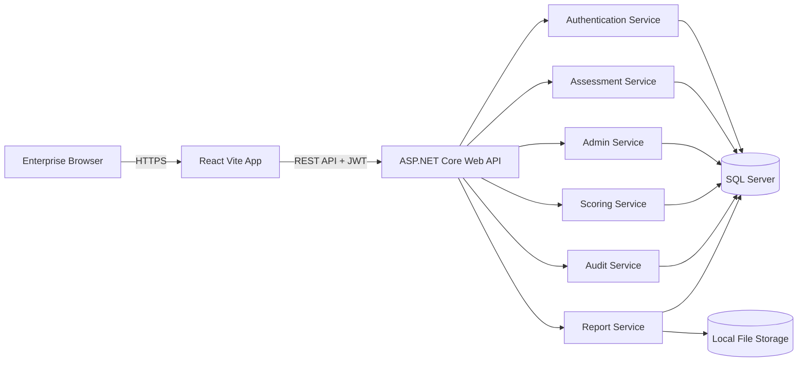
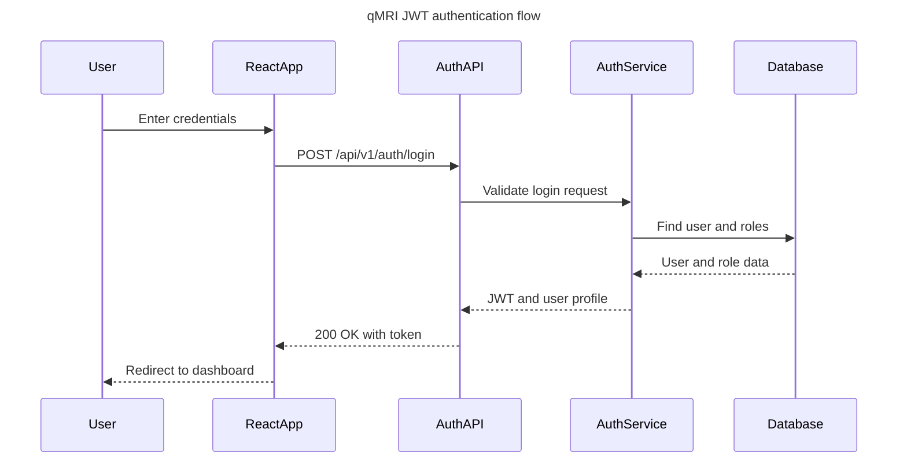
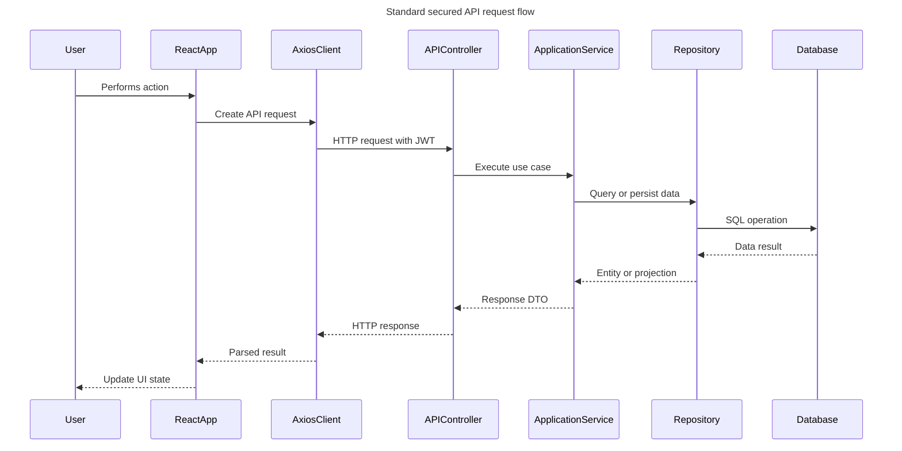
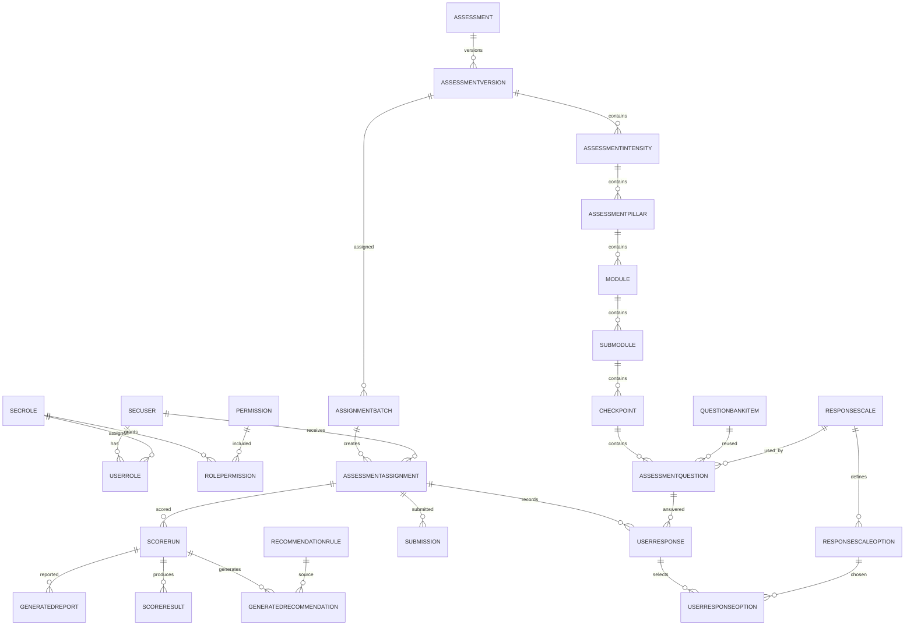
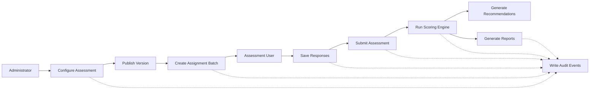

# qMRI Assessment Platform - Reference Plan

## Purpose

This document captures the product, UX, architecture, and database planning work for the qMRI Assessment Platform.

The qMRI Assessment Platform is an internal enterprise Quality Maturity Assessment application. It is not an online quiz or survey application. It is intended to evaluate organizational testing and quality engineering maturity across structured business pillars, generate maturity scores, provide analytics, and recommend improvement actions.

---

## Task 1 - Product Understanding And SRS

### Subtask 1.1 - Product Vision

The qMRI Assessment Platform will become the organization's standard internal platform for measuring quality maturity across teams, departments, and business units.

The platform should help leadership and quality teams:

- Understand current quality maturity.
- Identify maturity gaps.
- Compare performance across pillars and modules.
- Generate actionable recommendations.
- Track improvement over time.
- Produce enterprise-ready reports.

The product should feel like enterprise software similar to Microsoft Azure Portal, Microsoft Learn, Jira, Power BI, ServiceNow, or HackerRank Enterprise.

### Subtask 1.2 - Business Objective

The platform is designed to assess an organization's testing and quality engineering maturity through a structured hierarchy:

```text
Assessment
  -> Intensity
      -> Pillar
          -> Module
              -> Sub Module
                  -> Checkpoint
                      -> Question
                          -> User Response
                              -> Score
                                  -> Recommendation
```

### Subtask 1.3 - Product Objectives

- Provide a configurable quality maturity assessment model.
- Support Operational, Strategic, and Tactical intensities.
- Evaluate maturity across Technology, Operating Model, Process, and People pillars.
- Enable administrators to configure assessments, questions, weights, and recommendations.
- Allow assessment users to start, save, resume, review, and submit assessments.
- Generate score rollups and recommendations.
- Provide dashboards, analytics, reports, and exports.
- Maintain security, auditability, data integrity, and enterprise usability.

### Subtask 1.4 - Scope

#### In Scope

- User authentication.
- Role-based access control.
- Admin dashboard.
- Assessment user dashboard.
- Assessment builder.
- Question bank.
- Assessment assignment.
- Assessment execution.
- Save and resume progress.
- Review and submit assessment.
- Scoring engine.
- Recommendation engine.
- Analytics dashboards.
- Report generation and downloads.
- Audit logs.
- Local file storage for reports, exports, attachments, and logos.

#### Out Of Scope For Initial Release

- Public registration.
- Anonymous assessments.
- Payment or subscription features.
- External marketplace.
- AI-based scoring.
- Multi-tenant SaaS billing.
- External LMS, HRMS, or SSO integration unless prioritized later.

### Subtask 1.5 - User Personas

#### Administrator

The Administrator owns platform configuration, governance, assessment setup, scoring, recommendations, assignments, and reporting.

Administrator can:

- Manage users.
- Manage roles.
- Create assessments.
- Manage assessment hierarchy.
- Create and manage questions.
- Configure weights.
- Configure recommendations.
- Assign assessments.
- View reports.
- View analytics.
- View audit logs.
- Export reports.

#### Assessment User

The Assessment User completes assigned assessments and reviews results where permitted.

Assessment User can:

- View assigned assessments.
- Start assessment.
- Save progress.
- Resume assessment.
- Submit assessment.
- View results.
- Download reports.
- View recommendations.

### Subtask 1.6 - Functional Requirements

| ID | Requirement |
|---|---|
| FR-01 | The system shall allow authorized users to log in securely. |
| FR-02 | The system shall enforce role-based access. |
| FR-03 | Administrators shall manage users and roles. |
| FR-04 | Administrators shall create, edit, publish, archive, and deactivate assessments. |
| FR-05 | Administrators shall configure intensities: Operational, Strategic, Tactical. |
| FR-06 | Administrators shall configure pillars: Technology, Operating Model, Process, People. |
| FR-07 | Administrators shall manage modules, sub modules, checkpoints, and questions. |
| FR-08 | Questions shall support scoring metadata, weight, sequence, status, and recommendation mapping. |
| FR-09 | Administrators shall assign assessments to users or groups. |
| FR-10 | Assessment users shall view assigned assessments with status, due date, and progress. |
| FR-11 | Users shall read assessment instructions before starting. |
| FR-12 | Users shall answer questions, save progress, and resume incomplete assessments. |
| FR-13 | Users shall review responses before final submission. |
| FR-14 | Submitted responses shall be locked unless reopened by an authorized administrator. |
| FR-15 | The scoring engine shall calculate maturity scores from configured weights and responses. |
| FR-16 | Scores shall roll up by question, checkpoint, sub module, module, pillar, intensity, and assessment. |
| FR-17 | Recommendations shall be generated from score thresholds, gaps, or configured mappings. |
| FR-18 | Administrators shall view analytics across assessments, users, teams, pillars, and maturity levels. |
| FR-19 | Users shall view their results and recommendations when access is enabled. |
| FR-20 | The system shall generate downloadable reports and exports. |
| FR-21 | The system shall maintain audit logs for critical actions. |
| FR-22 | Lists shall support search, filters, sorting, and pagination. |
| FR-23 | The system shall support breadcrumb navigation across deep hierarchy screens. |
| FR-24 | Administrators shall manage local assets such as logos, attachments, exports, and reports. |

### Subtask 1.7 - Non Functional Requirements

| Category | Requirement |
|---|---|
| Security | JWT authentication, role-based authorization, protected APIs, secure password handling. |
| Performance | Dashboards and list pages should perform well for expected internal enterprise usage. |
| Scalability | Architecture must support more users, questions, reports, and assessment cycles. |
| Maintainability | Use Clean Architecture, Repository Pattern, Service Layer, DTO Pattern, and Dependency Injection. |
| Usability | UI must be professional, responsive, searchable, filterable, and data-friendly. |
| Reliability | Assessment progress must not be lost during normal navigation or session continuation. |
| Auditability | Critical actions must be timestamped and traceable to a user. |
| Data Integrity | Submitted assessments, scores, and reports must preserve historical consistency. |
| Accessibility | UI should support readable contrast, keyboard navigation, and accessible controls. |
| Compatibility | Frontend should support modern enterprise browsers. |
| Observability | Backend should support structured logging and error tracking. |
| File Handling | Reports, exports, attachments, and logos shall be stored in controlled local storage paths. |

### Subtask 1.8 - Business Rules

- An assessment must contain at least one intensity, pillar, module, checkpoint, and question before publishing.
- Published assessments should not allow structural changes that invalidate submitted results.
- Draft assessments may be edited by authorized administrators.
- Assessment responses can be saved before submission.
- Submitted responses are locked by default.
- Reopening a submitted assessment requires administrator permission and must be audited.
- Scoring must respect configured weights at each hierarchy level.
- Recommendations must be mapped to score ranges, maturity gaps, or checkpoints.
- Users can only access assessments assigned to them.
- Reports generated after submission must preserve the scoring version used at the time.
- Archive or deactivate is preferred over deleting historical configuration.
- Critical changes must capture user, timestamp, action, and affected entity.

### Subtask 1.9 - Acceptance Criteria

- Administrators can configure the complete assessment hierarchy without developer involvement.
- Administrators can publish and assign assessments.
- Users can start, save, resume, review, and submit assigned assessments.
- Submitted assessments trigger score calculation successfully.
- Scores are visible at all required hierarchy levels.
- Recommendations are generated from configured rules.
- Dashboards show progress, maturity status, and key metrics.
- Reports can be generated, stored, downloaded, and audited.
- Role-based access prevents unauthorized screens and API actions.
- Audit logs capture critical business events.
- Lists support search, filter, sort, and pagination.
- The UI presents the product as an enterprise maturity assessment platform.

---

## Task 2 - UI And UX Architecture

### Subtask 2.1 - Design Direction

The application should follow a Microsoft Fluent-inspired enterprise design approach:

- Left navigation.
- Top application bar.
- Global search.
- Breadcrumbs.
- Command bars.
- Data grids.
- KPI cards.
- Professional charts.
- Contextual right-side panels.
- Confirmation dialogs for critical actions.
- Dense but readable layouts.

The product should not look like a quiz app.

### Subtask 2.2 - Application Sitemap

```text
qMRI Assessment Platform
|
|-- Authentication
|   |-- Login
|   |-- Forgot Password
|   |-- Unauthorized Access
|
|-- Dashboard
|   |-- Executive Summary
|   |-- My Assessments
|   |-- Maturity Overview
|   |-- Recent Activity
|
|-- Assessments
|   |-- Assigned Assessments
|   |-- Assessment Details
|   |-- Instructions
|   |-- Assessment Workspace
|   |-- Review Answers
|   |-- Submit Assessment
|   |-- Results
|   |-- Recommendations
|   |-- Download Report
|
|-- Administration
|   |-- Admin Dashboard
|   |-- User Management
|   |-- Role Management
|   |-- Assessment Management
|   |-- Assessment Builder
|   |-- Question Bank
|   |-- Assignment Management
|   |-- Scoring Configuration
|   |-- Recommendation Library
|
|-- Analytics
|   |-- Maturity Dashboard
|   |-- Pillar Analytics
|   |-- Module Analytics
|   |-- Completion Analytics
|   |-- Comparative Analytics
|
|-- Reports
|   |-- Report Library
|   |-- Generated Reports
|   |-- Export History
|
|-- Governance
|   |-- Audit Logs
|   |-- File And Logo Management
|   |-- System Settings
|
|-- User
    |-- Profile
    |-- Notifications
    |-- Help
```

### Subtask 2.3 - Global Navigation

```text
Top Bar
|-- Product Logo
|-- Global Search
|-- Notifications
|-- Help
|-- User Profile

Left Navigation
|-- Dashboard
|-- My Assessments
|-- Results
|-- Reports
|-- Analytics
|-- Administration
    |-- Users
    |-- Roles
    |-- Assessments
    |-- Question Bank
    |-- Assignments
    |-- Scoring
    |-- Recommendations
    |-- Audit Logs
```

### Subtask 2.4 - Assessment User Journey

```text
Login
  -> Dashboard
    -> Assigned Assessments
      -> Assessment Details
        -> Instructions
          -> Start Or Resume Assessment
            -> Assessment Workspace
              -> Save Progress
              -> Review Answers
                -> Submit Assessment
                  -> Scoring
                    -> Results
                      -> Recommendations
                        -> Download Report
```

### Subtask 2.5 - Administrator Journey

```text
Login
  -> Admin Dashboard
    -> Manage Users And Roles
    -> Create Assessment
      -> Configure Hierarchy
      -> Configure Questions
      -> Configure Weights
      -> Configure Recommendations
      -> Preview Assessment
      -> Publish Assessment
      -> Assign Assessment
      -> Monitor Progress
      -> Review Results
      -> Generate Reports
      -> View Audit Logs
```

### Subtask 2.6 - Assessment Workspace Wireframe

```text
+----------------------------------------------------------+
| qMRI Strategic Assessment              Progress 62%       |
| Breadcrumb: Strategic / Process / Module / Checkpoint     |
+----------------------------------------------------------+
| Section Navigator       | Question Area                  |
|-------------------------|--------------------------------|
| Technology      80%     | Checkpoint: Test Governance    |
| Operating Model 70%     |                                |
| Process         45%     | Q12. How consistently are test |
| People          55%     | governance practices followed?|
|                         |                                |
|                         | ( ) Not Established            |
|                         | ( ) Initial                    |
|                         | ( ) Managed                    |
|                         | ( ) Defined                    |
|                         | ( ) Optimized                  |
|                         |                                |
|                         | Notes / Evidence               |
|                         | [Flag] [Previous] [Save] [Next]|
+----------------------------------------------------------+
```

### Subtask 2.7 - Admin Dashboard Wireframe

```text
+----------------------------------------------------------+
| Admin Dashboard                         [Create Assessment]|
+----------------------------------------------------------+
| [Active Assessments] [Completion Rate] [Avg Score] [Risk] |
+----------------------------------------------------------+
| Maturity Trend Chart        Pillar Score Distribution     |
| +---------------------+     +--------------------------+  |
| | Line / Area Chart   |     | Bar / Radar / Heatmap    |  |
| +---------------------+     +--------------------------+  |
|                                                          |
| Assessment Progress                                      |
| Search | Filter | Export                                 |
| +------------------------------------------------------+ |
| | Assessment | Assigned | Completed | Avg Score | Status | |
| +------------------------------------------------------+ |
|                                                          |
| Recent Activity / Audit Events                          |
+----------------------------------------------------------+
```

### Subtask 2.8 - Assessment Builder Wireframe

```text
+----------------------------------------------------------+
| Assessment Builder: qMRI Strategic Assessment             |
| Draft | Last saved 10:42 AM              [Preview] [Publish] |
+----------------------------------------------------------+
| Tree Navigator          | Detail Editor                  |
|-------------------------|--------------------------------|
| Assessment              | Selected Item: Process Pillar  |
|  Operational            | Name                           |
|  Strategic              | Description                    |
|   Technology            | Weight                         |
|   Operating Model       | Status                         |
|   Process               | Sequence                       |
|    Module               |                                |
|     Sub Module          | [Save Changes] [Deactivate]    |
|      Checkpoint         |                                |
|       Question          | Validation Messages            |
+----------------------------------------------------------+
```

---

## Task 3 - Software Architecture

### Subtask 3.1 - Technology Stack

#### Frontend

- React
- TypeScript
- Vite
- Material UI
- React Router
- React Hook Form
- Axios
- TanStack Query

#### Backend

- ASP.NET Core 9 Web API
- Entity Framework Core
- SQL Server
- JWT Authentication

#### Architecture

- Clean Architecture
- Repository Pattern
- Service Layer
- Dependency Injection
- DTO Pattern

### Subtask 3.2 - High-Level Architecture



### Subtask 3.3 - Frontend Architecture

```text
React App
|
|-- App Shell
|   |-- Top Bar
|   |-- Side Navigation
|   |-- Breadcrumbs
|   |-- Route Outlet
|
|-- Feature Modules
|   |-- Authentication
|   |-- Dashboard
|   |-- Assessments
|   |-- Assessment Builder
|   |-- Users And Roles
|   |-- Scoring
|   |-- Recommendations
|   |-- Reports
|   |-- Analytics
|   |-- Audit Logs
|
|-- Shared Layer
|   |-- UI Components
|   |-- Layout Components
|   |-- API Client
|   |-- Query Client
|   |-- Auth Context
|   |-- Route Guards
|   |-- Types
|   |-- Utilities
```

### Subtask 3.4 - Backend Clean Architecture

```text
qMRI.Api
  Presentation Layer
  Controllers, Middleware, Filters, Authentication Setup

qMRI.Application
  Application Layer
  Services, Use Cases, DTOs, Interfaces, Validators

qMRI.Domain
  Domain Layer
  Entities, Enums, Value Objects, Domain Rules

qMRI.Infrastructure
  Infrastructure Layer
  EF Core, Repositories, File Storage, JWT Provider, Report Storage

qMRI.Shared
  Shared Contracts
  Constants, Common Responses, Exceptions, Utilities
```

### Subtask 3.5 - Backend Module Architecture

| Module | Responsibility |
|---|---|
| Authentication | Login, JWT generation, password flows, current user context. |
| User Management | Users, roles, account status, permissions. |
| Assessment Management | Assessment lifecycle, publish, archive, configuration. |
| Hierarchy Management | Intensity, pillar, module, sub module, checkpoint, question. |
| Assignment Management | Assign assessments to users or groups. |
| Response Management | Save, resume, review, submit responses. |
| Scoring Engine | Weighted score calculation and maturity level determination. |
| Recommendation Engine | Recommendation generation based on scores and gaps. |
| Reporting | Report generation, export history, file references. |
| Analytics | Aggregated maturity, completion, and trend data. |
| Audit Logging | Track critical actions and entity changes. |
| File Storage | Reports, exports, logos, attachments. |

### Subtask 3.6 - API Architecture

Recommended API versioning:

```text
/api/v1/{resource}
```

Resource groups:

| Area | Example Resources |
|---|---|
| Auth | `/auth/login`, `/auth/me`, `/auth/refresh` |
| Users | `/users`, `/users/{id}`, `/roles` |
| Assessments | `/assessments`, `/assessments/{id}` |
| Builder | `/assessments/{id}/structure`, `/questions`, `/weights` |
| Assignments | `/assignments`, `/assignments/{id}` |
| Responses | `/assignments/{id}/responses`, `/responses/save` |
| Submission | `/assignments/{id}/submit` |
| Scores | `/assignments/{id}/scores` |
| Recommendations | `/assignments/{id}/recommendations` |
| Reports | `/reports`, `/reports/{id}/download` |
| Analytics | `/analytics/maturity`, `/analytics/completion` |
| Audit | `/audit-logs` |

### Subtask 3.7 - Authentication Flow



### Subtask 3.8 - Request And Response Flow



### Subtask 3.9 - Backend Folder Structure

```text
qMRI.sln
|
|-- src
|   |-- qMRI.Api
|   |   |-- Controllers
|   |   |-- Middleware
|   |   |-- Filters
|   |   |-- Extensions
|   |   |-- Program
|   |
|   |-- qMRI.Application
|   |   |-- Interfaces
|   |   |-- DTOs
|   |   |-- Services
|   |   |-- Validators
|   |   |-- Mappings
|   |   |-- UseCases
|   |
|   |-- qMRI.Domain
|   |   |-- Entities
|   |   |-- Enums
|   |   |-- ValueObjects
|   |   |-- DomainRules
|   |
|   |-- qMRI.Infrastructure
|   |   |-- Persistence
|   |   |-- Repositories
|   |   |-- Authentication
|   |   |-- FileStorage
|   |   |-- Reporting
|   |   |-- Audit
|   |
|   |-- qMRI.Shared
|       |-- Constants
|       |-- Exceptions
|       |-- Responses
|       |-- Utilities
|
|-- tests
|   |-- qMRI.UnitTests
|   |-- qMRI.IntegrationTests
|   |-- qMRI.ApiTests
```

### Subtask 3.10 - Frontend Folder Structure

```text
src
|
|-- app
|   |-- App.tsx
|   |-- routes
|   |-- providers
|   |-- theme
|
|-- layouts
|   |-- AppShell
|   |-- AuthLayout
|   |-- AdminLayout
|
|-- features
|   |-- auth
|   |-- dashboard
|   |-- assessments
|   |-- assessment-builder
|   |-- users
|   |-- roles
|   |-- scoring
|   |-- recommendations
|   |-- reports
|   |-- analytics
|   |-- audit-logs
|
|-- shared
|   |-- components
|   |-- hooks
|   |-- api
|   |-- types
|   |-- utils
|   |-- constants
|
|-- assets
|-- config
```

---

## Task 4 - Database Architecture

### Subtask 4.1 - Database Design Direction

Target database: SQL Server.

Design requirements:

- Fully normalized to 3NF.
- Enterprise-grade.
- Scalable.
- Audit-friendly.
- Supports soft delete.
- Supports assessment versioning.
- Protects historical submissions and scores.

Recommended schemas:

```text
ref       Lookup/reference data
sec       Users, roles, permissions, authentication
org       Organization structure and user groups
assess    Assessment model configuration
exec      Assessment assignment, progress, responses, submissions
score     Scoring, maturity levels, recommendations
report    Files, reports, exports
audit     Audit trail and column-level changes
```

### Subtask 4.2 - Core Database ER Diagram



### Subtask 4.3 - Table List And Purpose

| Schema | Table | Purpose |
|---|---|---|
| ref | AssessmentStatuses | Draft, Published, Archived, Retired lifecycle statuses. |
| ref | AssignmentStatuses | Not Started, In Progress, Submitted, Scored, Reopened. |
| ref | IntensityTypes | Operational, Strategic, Tactical. |
| ref | PillarTypes | Technology, Operating Model, Process, People. |
| ref | QuestionTypes | Single choice, multi choice, text, numeric, evidence-only. |
| ref | ScoreScopeTypes | Assessment, intensity, pillar, module, sub module, checkpoint, question. |
| ref | RecommendationPriorities | High, Medium, Low, Critical. |
| ref | ReportTypes | Executive summary, detailed report, export. |
| sec | Users | Internal platform users. |
| sec | Roles | Administrator, Assessment User, future Manager or Viewer roles. |
| sec | Permissions | Fine-grained capabilities for policy authorization. |
| sec | UserRoles | User-role mapping. |
| sec | RolePermissions | Role-permission mapping. |
| sec | RefreshTokens | Optional JWT refresh and revocation support. |
| org | OrganizationUnits | Business unit, department, team hierarchy. |
| org | UserGroups | Assignment groups. |
| org | UserGroupMembers | Users belonging to assignment groups. |
| assess | Assessments | Logical assessment family. |
| assess | AssessmentVersions | Versioned, publishable assessment definition. |
| assess | AssessmentIntensities | Version-specific intensity nodes. |
| assess | AssessmentPillars | Version-specific pillar nodes. |
| assess | Modules | Functional maturity modules under a pillar. |
| assess | SubModules | Lower-level grouping under modules. |
| assess | Checkpoints | Assessment checkpoints under sub modules. |
| assess | QuestionBankItems | Reusable canonical question text. |
| assess | ResponseScales | Reusable response scales. |
| assess | ResponseScaleOptions | Scale options and score values. |
| assess | AssessmentQuestions | Version-bound question placement, weight, and requirement rules. |
| exec | AssignmentBatches | One assignment campaign created by admin. |
| exec | AssessmentAssignments | One assigned assessment per user. |
| exec | UserResponses | User answer record per assigned question. |
| exec | UserResponseOptions | Selected options for choice-based responses. |
| exec | ResponseAttachments | Evidence files attached to responses. |
| exec | Submissions | Final submission lock and declaration record. |
| score | ScoringModels | Scoring algorithm and version metadata. |
| score | MaturityLevels | Configurable score bands. |
| score | ScoreRuns | Each scoring execution for a submitted assignment. |
| score | ScoreResults | Score rollups by assessment hierarchy level. |
| score | RecommendationRules | Configured recommendations by scope and score range. |
| score | GeneratedRecommendations | Historical recommendation snapshot generated after scoring. |
| report | FileAssets | Metadata for reports, exports, logos, and attachments. |
| report | ReportTemplates | Report layout and template metadata. |
| report | GeneratedReports | Generated report records linked to file storage. |
| report | ExportHistory | Export history for tables and analytics. |
| audit | AuditEvents | Append-only business event header. |
| audit | AuditChanges | Column-level old and new values. |

### Subtask 4.4 - Column Definition Standards

| Column Type | Standard |
|---|---|
| Domain primary keys | uniqueidentifier |
| High-volume audit primary keys | bigint identity |
| Dates | datetime2(7) |
| Codes | varchar(50) |
| Names | nvarchar(200) |
| Long text | nvarchar(max) |
| Scores and weights | decimal(9,4) |
| Concurrency | rowversion |
| Booleans | bit |

### Subtask 4.5 - Key Table Columns

#### Security

| Table | Primary Columns |
|---|---|
| sec.Users | UserId PK, Email UK, DisplayName, PasswordHash, PrimaryOrgUnitId FK, IsActive, LastLoginAt, audit columns |
| sec.Roles | RoleId PK, Code UK, Name, Description, IsSystemRole, audit columns |
| sec.Permissions | PermissionId PK, Code UK, Name, Description, ModuleName |
| sec.UserRoles | UserRoleId PK, UserId FK, RoleId FK, AssignedAt, AssignedByUserId FK |
| sec.RolePermissions | RolePermissionId PK, RoleId FK, PermissionId FK |
| sec.RefreshTokens | RefreshTokenId PK, UserId FK, TokenHash, ExpiresAt, RevokedAt, CreatedAt |

#### Assessment Configuration

| Table | Primary Columns |
|---|---|
| assess.Assessments | AssessmentId PK, Code UK, Title, Description, OwnerUserId FK, audit columns |
| assess.AssessmentVersions | AssessmentVersionId PK, AssessmentId FK, VersionNumber, StatusId FK, ScoringModelId FK, Instructions, PublishedAt, PublishedByUserId FK, audit columns |
| assess.AssessmentIntensities | AssessmentIntensityId PK, AssessmentVersionId FK, IntensityTypeId FK, Weight, Sequence, audit columns |
| assess.AssessmentPillars | AssessmentPillarId PK, AssessmentIntensityId FK, PillarTypeId FK, Weight, Sequence, audit columns |
| assess.Modules | ModuleId PK, AssessmentPillarId FK, Name, Description, Weight, Sequence, audit columns |
| assess.SubModules | SubModuleId PK, ModuleId FK, Name, Description, Weight, Sequence, audit columns |
| assess.Checkpoints | CheckpointId PK, SubModuleId FK, Name, Description, Weight, Sequence, audit columns |
| assess.QuestionBankItems | QuestionBankItemId PK, QuestionTypeId FK, QuestionText, HelpText, IsReusable, audit columns |
| assess.ResponseScales | ResponseScaleId PK, Code UK, Name, Description, MinScore, MaxScore, audit columns |
| assess.ResponseScaleOptions | ResponseScaleOptionId PK, ResponseScaleId FK, Label, Description, ScoreValue, Sequence, IsDefault |
| assess.AssessmentQuestions | AssessmentQuestionId PK, CheckpointId FK, QuestionBankItemId FK, ResponseScaleId FK, QuestionCode, Weight, Sequence, IsRequired, IsScored, EvidenceRequired, audit columns |

#### Execution

| Table | Primary Columns |
|---|---|
| exec.AssignmentBatches | AssignmentBatchId PK, AssessmentVersionId FK, Name, AssignedByUserId FK, DueAt, InstructionsOverride, audit columns |
| exec.AssessmentAssignments | AssessmentAssignmentId PK, AssignmentBatchId FK, AssessmentVersionId FK, AssignedToUserId FK, AssignmentStatusId FK, StartedAt, SubmittedAt, CurrentQuestionId FK, audit columns |
| exec.UserResponses | UserResponseId PK, AssessmentAssignmentId FK, AssessmentQuestionId FK, ResponseText, ResponseNumber, Notes, IsFlagged, SavedAt, audit columns |
| exec.UserResponseOptions | UserResponseOptionId PK, UserResponseId FK, ResponseScaleOptionId FK |
| exec.ResponseAttachments | ResponseAttachmentId PK, UserResponseId FK, FileAssetId FK, UploadedByUserId FK, UploadedAt |
| exec.Submissions | SubmissionId PK, AssessmentAssignmentId FK, SubmittedByUserId FK, SubmittedAt, DeclarationAccepted, SubmissionVersion |

#### Scoring And Recommendations

| Table | Primary Columns |
|---|---|
| score.ScoringModels | ScoringModelId PK, Code UK, Name, Version, AlgorithmName, IsActive, audit columns |
| score.MaturityLevels | MaturityLevelId PK, ScoringModelId FK, Code, Name, MinScore, MaxScore, Sequence |
| score.ScoreRuns | ScoreRunId PK, AssessmentAssignmentId FK, ScoringModelId FK, CalculatedAt, CalculatedByUserId FK, AlgorithmVersion, IsFinal |
| score.ScoreResults | ScoreResultId PK, ScoreRunId FK, ScoreScopeTypeId FK, hierarchy nullable FKs, RawScore, WeightedScore, MaxScore, PercentageScore, MaturityLevelId FK |
| score.RecommendationRules | RecommendationRuleId PK, AssessmentVersionId FK, ScoreScopeTypeId FK, hierarchy nullable FKs, MinScore, MaxScore, PriorityId FK, RecommendationText, Rationale, audit columns |
| score.GeneratedRecommendations | GeneratedRecommendationId PK, ScoreRunId FK, RecommendationRuleId FK, PriorityId FK, RecommendationTextSnapshot, ScopeSummary, CreatedAt |

### Subtask 4.6 - Primary Key Strategy

- Domain, configuration, and execution tables use `uniqueidentifier`.
- High-volume audit event tables may use `bigint identity`.
- Join tables may use surrogate keys plus unique composite indexes.
- Primary keys should be immutable.

### Subtask 4.7 - Foreign Key Strategy

Important foreign keys:

- `AssessmentVersions.AssessmentId -> Assessments.AssessmentId`
- `AssessmentIntensities.AssessmentVersionId -> AssessmentVersions.AssessmentVersionId`
- `AssessmentPillars.AssessmentIntensityId -> AssessmentIntensities.AssessmentIntensityId`
- `Modules.AssessmentPillarId -> AssessmentPillars.AssessmentPillarId`
- `SubModules.ModuleId -> Modules.ModuleId`
- `Checkpoints.SubModuleId -> SubModules.SubModuleId`
- `AssessmentQuestions.CheckpointId -> Checkpoints.CheckpointId`
- `AssessmentQuestions.QuestionBankItemId -> QuestionBankItems.QuestionBankItemId`
- `AssessmentAssignments.AssessmentVersionId -> AssessmentVersions.AssessmentVersionId`
- `UserResponses.AssessmentAssignmentId -> AssessmentAssignments.AssessmentAssignmentId`
- `UserResponses.AssessmentQuestionId -> AssessmentQuestions.AssessmentQuestionId`
- `ScoreRuns.AssessmentAssignmentId -> AssessmentAssignments.AssessmentAssignmentId`
- `GeneratedReports.ScoreRunId -> ScoreRuns.ScoreRunId`

Use restrict or no action for most business foreign keys. Avoid physical cascade delete for assessment, response, score, report, and audit data.

### Subtask 4.8 - Index Strategy

| Table | Index |
|---|---|
| sec.Users | Unique filtered index on Email where IsDeleted = 0 |
| sec.UserRoles | Unique index on UserId, RoleId |
| assess.Assessments | Unique filtered index on Code where IsDeleted = 0 |
| assess.AssessmentVersions | Unique index on AssessmentId, VersionNumber |
| assess.AssessmentIntensities | Unique index on AssessmentVersionId, IntensityTypeId |
| assess.AssessmentPillars | Unique index on AssessmentIntensityId, PillarTypeId |
| assess.Modules | Index on AssessmentPillarId, Sequence |
| assess.SubModules | Index on ModuleId, Sequence |
| assess.Checkpoints | Index on SubModuleId, Sequence |
| assess.AssessmentQuestions | Unique index on CheckpointId, Sequence |
| exec.AssessmentAssignments | Index on AssignedToUserId, AssignmentStatusId, DueAt |
| exec.UserResponses | Unique index on AssessmentAssignmentId, AssessmentQuestionId |
| score.ScoreRuns | Index on AssessmentAssignmentId, CalculatedAt DESC |
| score.ScoreResults | Index on ScoreRunId, ScoreScopeTypeId |
| score.GeneratedRecommendations | Index on ScoreRunId, PriorityId |
| report.GeneratedReports | Index on ScoreRunId, GeneratedAt DESC |
| audit.AuditEvents | Index on OccurredAt DESC, ActorUserId, EntityName, EntityKey |

All foreign key columns should have supporting nonclustered indexes.

### Subtask 4.9 - Lookup Tables

Minimum lookup tables:

```text
ref.AssessmentStatuses
ref.AssignmentStatuses
ref.IntensityTypes
ref.PillarTypes
ref.QuestionTypes
ref.ScoreScopeTypes
ref.RecommendationPriorities
ref.ReportTypes
ref.FileCategories
ref.AuditActionTypes
```

Lookup columns:

```text
Id
Code
Name
Description
SortOrder
IsActive
CreatedAt
CreatedByUserId
ModifiedAt
ModifiedByUserId
RowVersion
```

### Subtask 4.10 - Audit Columns

Every business table should include:

```text
CreatedAt
CreatedByUserId
ModifiedAt
ModifiedByUserId
IsDeleted
DeletedAt
DeletedByUserId
DeleteReason
RowVersion
```

Rules:

- CreatedAt and CreatedByUserId are required for business rows.
- ModifiedAt and ModifiedByUserId update on every change.
- RowVersion supports optimistic concurrency.
- AuditEvents capture business-level actions.
- AuditChanges capture field-level old and new values.

### Subtask 4.11 - Soft Delete Strategy

Use soft delete for business data:

```text
IsDeleted = 0 active
IsDeleted = 1 deleted
DeletedAt records deletion time
DeletedByUserId records actor
DeleteReason records business reason
```

Rules:

- Do not hard-delete submitted assessments, responses, scores, recommendations, reports, or audit records.
- Published assessment versions should be archived, not deleted.
- Draft configuration may be soft-deleted.
- Lookup values should be deactivated using IsActive, not deleted.
- Unique indexes should be filtered with IsDeleted = 0.
- Background cleanup may hard-delete only transient security tokens after retention expiry.

### Subtask 4.12 - Database Flow



---

## Task 5 - Implementation Roadmap

### Subtask 5.1 - Foundation

- Create repository structure.
- Create backend solution and projects.
- Create frontend Vite React app.
- Configure Material UI theme.
- Configure routing.
- Configure API client.
- Configure SQL Server connection.
- Establish coding standards.

### Subtask 5.2 - Database Foundation

- Create database schemas.
- Create lookup tables.
- Create security tables.
- Create assessment configuration tables.
- Create execution tables.
- Create scoring and recommendation tables.
- Create reporting and audit tables.
- Add seed data for roles, statuses, intensities, pillars, and lookup values.

### Subtask 5.3 - Authentication And Authorization

- Implement user login.
- Implement JWT generation.
- Implement role-based authorization.
- Implement protected frontend routes.
- Implement current user endpoint.
- Add audit events for login and security actions.

### Subtask 5.4 - Admin Foundation

- User management.
- Role management.
- Assessment management.
- Assessment builder.
- Question bank.
- Weight configuration.
- Recommendation configuration.

### Subtask 5.5 - Assessment Execution

- Assigned assessments.
- Instructions screen.
- Assessment workspace.
- Save progress.
- Resume progress.
- Review answers.
- Submit assessment.
- Lock submitted responses.

### Subtask 5.6 - Scoring And Recommendations

- Implement scoring model.
- Calculate score by hierarchy level.
- Store score runs.
- Store score results.
- Generate recommendations.
- Preserve generated recommendation snapshots.

### Subtask 5.7 - Reports And Analytics

- Generate assessment reports.
- Store report file metadata.
- Download reports.
- Build maturity dashboard.
- Build completion dashboard.
- Build pillar and module analytics.
- Build export history.

### Subtask 5.8 - Governance And Hardening

- Audit event logging.
- Audit change tracking.
- Soft delete behavior.
- Error handling.
- Structured logging.
- Validation.
- Pagination and filtering.
- Security review.
- Performance review.

---

## Task 6 - Key Architecture Decisions

| Area | Decision |
|---|---|
| UI Pattern | Enterprise shell with role-based navigation. |
| API Style | REST with `/api/v1` versioning. |
| Auth | JWT authentication with role and policy authorization. |
| Backend Pattern | Clean Architecture. |
| Data Access | EF Core with Repository Pattern. |
| Business Logic | Application Services and Domain Rules. |
| Scoring | Dedicated Scoring Service. |
| Recommendations | Dedicated Recommendation Service. |
| Reporting | Report Service with local file storage. |
| Audit | Centralized append-only audit logging. |
| Frontend State | TanStack Query for server state. |
| Forms | React Hook Form. |
| UI Framework | Material UI with Fluent-inspired enterprise design. |
| Database | SQL Server, normalized, version-safe, audit-friendly. |

---

## Task 7 - Future Enterprise Enhancements

### Subtask 7.1 - Future Platform Capabilities

- Enterprise SSO.
- Department and team hierarchy.
- Reviewer role.
- Approval workflow.
- Scheduled assessments.
- Multi-cycle trend comparison.
- Power BI export.
- Email notifications.
- Background jobs for report generation.
- Executive read-only dashboards.
- Configurable maturity levels.
- Assessment import/export.
- Evidence review workflow.
- Data retention policies.

### Subtask 7.2 - Future Technical Capabilities

- Refresh token rotation.
- Background worker service.
- Cache layer.
- Centralized logging.
- Health checks.
- API rate limiting.
- Feature flags.
- Advanced audit reporting.
- File virus scanning.
- Report template designer.


---

## Task 8 - REST API Contract

### Subtask 8.1 - API Standards

Base path:

```text
/api/v1
```

Protected endpoints require:

```text
Authorization: Bearer {jwtToken}
Content-Type: application/json
```

Standard success response:

```text
ApiResponse<T>
- data: T
- message: string
- correlationId: string
- timestamp: datetime
```

Standard paged response:

```text
PagedResult<T>
- items: T[]
- pageNumber: int
- pageSize: int
- totalCount: int
- totalPages: int
```

Standard error response:

```text
ApiErrorResponse
- errorCode: string
- message: string
- validationErrors: field/message[]
- correlationId: string
- timestamp: datetime
```

Common status codes:

| Code | Meaning |
|---|---|
| 200 | Success |
| 201 | Created |
| 204 | Success with no response body |
| 400 | Validation or bad request |
| 401 | Not authenticated |
| 403 | Not authorized |
| 404 | Resource not found |
| 409 | Conflict or concurrency issue |
| 422 | Business rule violation |
| 500 | Unexpected server error |

API design rules:

- Use nouns for resources.
- Use action endpoints only for domain actions such as publish, archive, submit, generate, reopen, and reorder.
- Never expose EF Core entities directly.
- Use request and response DTOs for every endpoint.
- Use pagination for all list endpoints.
- Enforce assignment ownership for assessment user endpoints.
- Enforce administrator or policy authorization for admin endpoints.
- Log audit events for create, update, delete, publish, assign, submit, score, report generation, and settings changes.
- Use consistent error codes across the platform.

### Subtask 8.2 - Authentication APIs

| Endpoint | Method | URL | Description | Request DTO | Response DTO | Status Codes |
|---|---|---|---|---|---|---|
| Login | POST | `/api/v1/auth/login` | Authenticates user and returns JWT token. | `LoginRequestDto` | `AuthTokenResponseDto` | 200, 400, 401, 423, 500 |
| Current User | GET | `/api/v1/auth/me` | Returns authenticated user profile, roles, and permissions. | None | `CurrentUserDto` | 200, 401, 404 |
| Refresh Token | POST | `/api/v1/auth/refresh` | Issues new access token from a valid refresh token. | `RefreshTokenRequestDto` | `AuthTokenResponseDto` | 200, 400, 401 |
| Logout | POST | `/api/v1/auth/logout` | Revokes current refresh token or session. | `LogoutRequestDto` | None | 204, 401 |

DTOs:

```text
LoginRequestDto
- email: string
- password: string

RefreshTokenRequestDto
- refreshToken: string

LogoutRequestDto
- refreshToken: string optional

AuthTokenResponseDto
- accessToken: string
- refreshToken: string optional
- expiresAt: datetime
- user: CurrentUserDto

CurrentUserDto
- userId: guid
- email: string
- displayName: string
- roles: string[]
- permissions: string[]
- primaryOrgUnitId: guid optional
```

Validation rules:

- Email is required and must be valid format.
- Password is required for login.
- User must exist and be active.
- Refresh token must not be expired or revoked.
- JWT must be valid for protected calls.

Error responses:

```text
AUTH_INVALID_CREDENTIALS
AUTH_USER_INACTIVE
AUTH_ACCOUNT_LOCKED
AUTH_TOKEN_INVALID
AUTH_REFRESH_TOKEN_INVALID
AUTH_REFRESH_TOKEN_EXPIRED
USER_NOT_FOUND
```

### Subtask 8.3 - Dashboard APIs

| Endpoint | Method | URL | Description | Request DTO | Response DTO | Status Codes |
|---|---|---|---|---|---|---|
| Admin Dashboard Summary | GET | `/api/v1/dashboard/admin-summary` | Returns administrator dashboard KPIs. | Query parameters | `AdminDashboardSummaryDto` | 200, 400, 401, 403 |
| User Dashboard Summary | GET | `/api/v1/dashboard/my-summary` | Returns current user's assessment dashboard KPIs. | None | `UserDashboardSummaryDto` | 200, 401 |

Admin dashboard query parameters:

```text
fromDate: date optional
toDate: date optional
assessmentVersionId: guid optional
orgUnitId: guid optional
```

DTOs:

```text
AdminDashboardSummaryDto
- activeAssessments: int
- assignedAssessments: int
- completionRate: decimal
- averageMaturityScore: decimal
- overdueAssignments: int
- recentActivity: AuditActivityDto[]

UserDashboardSummaryDto
- assignedCount: int
- inProgressCount: int
- dueSoonCount: int
- completedCount: int
- continueAssessment: AssignedAssessmentDto optional
- recentResults: AssessmentResultSummaryDto[]
```

Validation rules:

- `fromDate` must be before `toDate`.
- Admin dashboard requires administrator or analytics permission.
- User dashboard requires authenticated user.

Error responses:

```text
AUTH_TOKEN_INVALID
AUTH_FORBIDDEN
DATE_RANGE_INVALID
ASSESSMENT_VERSION_NOT_FOUND
ORG_UNIT_NOT_FOUND
```

### Subtask 8.4 - Users APIs

| Endpoint | Method | URL | Description | Request DTO | Response DTO | Status Codes |
|---|---|---|---|---|---|---|
| List Users | GET | `/api/v1/users` | Returns paginated users. | Query parameters | `PagedResult<UserListItemDto>` | 200, 400, 401, 403 |
| Get User | GET | `/api/v1/users/{userId}` | Returns user details. | None | `UserDetailDto` | 200, 401, 403, 404 |
| Create User | POST | `/api/v1/users` | Creates a new internal user. | `CreateUserRequestDto` | `UserDetailDto` | 201, 400, 401, 403, 409 |
| Update User | PUT | `/api/v1/users/{userId}` | Updates user profile, roles, and status. | `UpdateUserRequestDto` | `UserDetailDto` | 200, 400, 401, 403, 404, 409 |
| Deactivate User | DELETE | `/api/v1/users/{userId}` | Soft-deactivates a user. | `SoftDeleteRequestDto` | None | 204, 401, 403, 404, 422 |

Query parameters:

```text
search: string optional
roleId: guid optional
isActive: bool optional
orgUnitId: guid optional
pageNumber: int
pageSize: int
sortBy: string optional
sortDirection: asc|desc
```

DTOs:

```text
CreateUserRequestDto
- email: string
- displayName: string
- password: string optional
- roleIds: guid[]
- primaryOrgUnitId: guid optional
- isActive: bool

UpdateUserRequestDto
- email: string
- displayName: string
- roleIds: guid[]
- primaryOrgUnitId: guid optional
- isActive: bool
- rowVersion: string optional

UserListItemDto
- userId: guid
- email: string
- displayName: string
- roles: string[]
- isActive: bool
- lastLoginAt: datetime optional

UserDetailDto
- userId: guid
- email: string
- displayName: string
- roles: RoleDto[]
- primaryOrgUnit: LookupDto optional
- isActive: bool
- createdAt: datetime
- modifiedAt: datetime optional
- rowVersion: string
```

Validation rules:

- `pageNumber >= 1`.
- `pageSize` must be between 1 and 100.
- Sort field must be allowlisted.
- Email is required and unique.
- Display name is required.
- Role IDs must exist.
- Org unit must exist if supplied.
- A user cannot deactivate themselves if they are the last active administrator.
- Soft delete reason is required.

Error responses:

```text
PAGING_INVALID
SORT_FIELD_INVALID
USER_NOT_FOUND
USER_EMAIL_EXISTS
ROLE_NOT_FOUND
ORG_UNIT_NOT_FOUND
LAST_ADMIN_CANNOT_BE_DEACTIVATED
CONCURRENCY_CONFLICT
AUTH_FORBIDDEN
```

### Subtask 8.5 - Roles APIs

| Endpoint | Method | URL | Description | Request DTO | Response DTO | Status Codes |
|---|---|---|---|---|---|---|
| List Roles | GET | `/api/v1/roles` | Lists roles. | Query parameters | `RoleDto[]` | 200, 401, 403 |
| Get Role | GET | `/api/v1/roles/{roleId}` | Returns role details and permissions. | None | `RoleDetailDto` | 200, 401, 403, 404 |
| Create Role | POST | `/api/v1/roles` | Creates a role. | `CreateRoleRequestDto` | `RoleDto` | 201, 400, 403, 409 |
| Update Role | PUT | `/api/v1/roles/{roleId}` | Updates role and permissions. | `UpdateRoleRequestDto` | `RoleDto` | 200, 400, 403, 404, 409 |
| Deactivate Role | DELETE | `/api/v1/roles/{roleId}` | Soft-deactivates a role. | `SoftDeleteRequestDto` | None | 204, 401, 403, 404, 422 |

DTOs:

```text
CreateRoleRequestDto
- code: string
- name: string
- description: string optional
- permissionIds: guid[]

UpdateRoleRequestDto
- name: string
- description: string optional
- permissionIds: guid[]
- isActive: bool
- rowVersion: string optional

RoleDto
- roleId: guid
- code: string
- name: string
- description: string optional
- isSystemRole: bool
- isActive: bool

RoleDetailDto
- roleId: guid
- code: string
- name: string
- description: string optional
- permissions: PermissionDto[]
- isSystemRole: bool
- isActive: bool
- rowVersion: string
```

Validation rules:

- Code is required and unique.
- Name is required.
- Permissions must exist.
- System roles cannot be renamed unless explicitly allowed.
- Role cannot be deactivated if assigned to active users unless reassigned or allowed by policy.

Error responses:

```text
ROLE_NOT_FOUND
ROLE_CODE_EXISTS
PERMISSION_NOT_FOUND
SYSTEM_ROLE_LOCKED
ROLE_ASSIGNED_TO_ACTIVE_USERS
CONCURRENCY_CONFLICT
AUTH_FORBIDDEN
```

### Subtask 8.6 - Assessment APIs

| Endpoint | Method | URL | Description | Request DTO | Response DTO | Status Codes |
|---|---|---|---|---|---|---|
| List Assessments | GET | `/api/v1/assessments` | Lists assessment families and versions. | Query parameters | `PagedResult<AssessmentListItemDto>` | 200, 400, 401, 403 |
| Create Assessment | POST | `/api/v1/assessments` | Creates assessment family and initial draft version. | `CreateAssessmentRequestDto` | `AssessmentDetailDto` | 201, 400, 403, 409 |
| Get Assessment | GET | `/api/v1/assessments/{assessmentId}` | Gets assessment and version details. | None | `AssessmentDetailDto` | 200, 403, 404 |
| Update Assessment | PUT | `/api/v1/assessments/{assessmentId}` | Updates assessment metadata. | `UpdateAssessmentRequestDto` | `AssessmentDetailDto` | 200, 400, 403, 404, 409 |
| Create Version | POST | `/api/v1/assessments/{assessmentId}/versions` | Creates new draft version. | `CreateAssessmentVersionRequestDto` | `AssessmentVersionDto` | 201, 400, 403, 404, 409 |
| Get Structure | GET | `/api/v1/assessment-versions/{versionId}/structure` | Returns full assessment hierarchy. | None | `AssessmentStructureDto` | 200, 403, 404 |
| Publish Version | POST | `/api/v1/assessment-versions/{versionId}/publish` | Validates and publishes assessment version. | `PublishAssessmentRequestDto` | `AssessmentVersionDto` | 200, 400, 403, 404, 422 |
| Archive Version | POST | `/api/v1/assessment-versions/{versionId}/archive` | Archives a published version. | `ArchiveRequestDto` | `AssessmentVersionDto` | 200, 403, 404, 422 |

Query parameters:

```text
search: string optional
statusId: guid optional
ownerUserId: guid optional
pageNumber: int
pageSize: int
sortBy: string optional
sortDirection: asc|desc
```

DTOs:

```text
CreateAssessmentRequestDto
- code: string
- title: string
- description: string optional
- ownerUserId: guid optional
- instructions: string optional

UpdateAssessmentRequestDto
- title: string
- description: string optional
- ownerUserId: guid optional
- rowVersion: string optional

CreateAssessmentVersionRequestDto
- versionNumber: int
- instructions: string optional
- scoringModelId: guid

PublishAssessmentRequestDto
- publishNotes: string optional

AssessmentDetailDto
- assessmentId: guid
- code: string
- title: string
- description: string optional
- ownerUserId: guid optional
- versions: AssessmentVersionDto[]
- rowVersion: string

AssessmentVersionDto
- assessmentVersionId: guid
- assessmentId: guid
- versionNumber: int
- status: LookupDto
- scoringModelId: guid
- instructions: string optional
- publishedAt: datetime optional
- publishedByUserId: guid optional

AssessmentStructureDto
- assessmentVersionId: guid
- intensities: AssessmentIntensityDto[]
```

Validation rules:

- Assessment code is required and unique.
- Assessment title is required.
- Owner must exist if supplied.
- Assessment version number must be unique per assessment.
- Only draft versions are editable.
- Publish requires at least one intensity, pillar, module, checkpoint, and question.
- Publish requires valid weights and scoring configuration.
- Archive reason is required.

Error responses:

```text
ASSESSMENT_NOT_FOUND
ASSESSMENT_CODE_EXISTS
ASSESSMENT_VERSION_NOT_FOUND
ASSESSMENT_VERSION_EXISTS
ASSESSMENT_NOT_DRAFT
ASSESSMENT_VERSION_NOT_EDITABLE
ASSESSMENT_STRUCTURE_INCOMPLETE
WEIGHT_VALIDATION_FAILED
OWNER_NOT_FOUND
ARCHIVE_REASON_REQUIRED
CONCURRENCY_CONFLICT
```

### Subtask 8.7 - Question Bank APIs

| Endpoint | Method | URL | Description | Request DTO | Response DTO | Status Codes |
|---|---|---|---|---|---|---|
| List Question Bank | GET | `/api/v1/question-bank` | Lists reusable questions. | Query parameters | `PagedResult<QuestionBankItemDto>` | 200, 400, 403 |
| Get Question Bank Item | GET | `/api/v1/question-bank/{questionBankItemId}` | Returns reusable question detail. | None | `QuestionBankItemDto` | 200, 403, 404 |
| Create Question Bank Item | POST | `/api/v1/question-bank` | Creates reusable question. | `CreateQuestionBankItemRequestDto` | `QuestionBankItemDto` | 201, 400, 403 |
| Update Question Bank Item | PUT | `/api/v1/question-bank/{questionBankItemId}` | Updates reusable question. | `UpdateQuestionBankItemRequestDto` | `QuestionBankItemDto` | 200, 400, 403, 404, 409, 422 |
| Delete Question Bank Item | DELETE | `/api/v1/question-bank/{questionBankItemId}` | Soft-deletes reusable question. | `SoftDeleteRequestDto` | None | 204, 403, 404, 422 |

Query parameters:

```text
search: string optional
questionTypeId: guid optional
isReusable: bool optional
pageNumber: int
pageSize: int
```

DTOs:

```text
CreateQuestionBankItemRequestDto
- questionTypeId: guid
- questionText: string
- helpText: string optional
- isReusable: bool

UpdateQuestionBankItemRequestDto
- questionTypeId: guid
- questionText: string
- helpText: string optional
- isReusable: bool
- rowVersion: string optional

QuestionBankItemDto
- questionBankItemId: guid
- questionType: LookupDto
- questionText: string
- helpText: string optional
- isReusable: bool
- rowVersion: string
```

Validation rules:

- Question text is required.
- Question type must exist.
- Reusable question cannot be deleted if referenced by a published assessment unless policy allows archival.
- Question text cannot be modified if locked by a published version unless versioning policy allows it.

Error responses:

```text
QUESTION_BANK_ITEM_NOT_FOUND
QUESTION_TEXT_REQUIRED
QUESTION_TYPE_NOT_FOUND
QUESTION_LOCKED_BY_PUBLISHED_ASSESSMENT
QUESTION_IN_USE
CONCURRENCY_CONFLICT
```

### Subtask 8.8 - Modules APIs

| Endpoint | Method | URL | Description | Request DTO | Response DTO | Status Codes |
|---|---|---|---|---|---|---|
| Create Module | POST | `/api/v1/assessment-pillars/{pillarId}/modules` | Creates module under pillar. | `CreateModuleRequestDto` | `ModuleDto` | 201, 400, 403, 404, 422 |
| Get Module | GET | `/api/v1/modules/{moduleId}` | Returns module details. | None | `ModuleDto` | 200, 403, 404 |
| Update Module | PUT | `/api/v1/modules/{moduleId}` | Updates module. | `UpdateModuleRequestDto` | `ModuleDto` | 200, 400, 403, 404, 422 |
| Delete Module | DELETE | `/api/v1/modules/{moduleId}` | Soft-deletes module. | `SoftDeleteRequestDto` | None | 204, 403, 404, 422 |
| Reorder Modules | PUT | `/api/v1/assessment-pillars/{pillarId}/modules/reorder` | Updates module sequence under pillar. | `ReorderItemsRequestDto` | `ModuleDto[]` | 200, 400, 403, 404, 422 |

DTOs:

```text
CreateModuleRequestDto
- name: string
- description: string optional
- weight: decimal
- sequence: int

UpdateModuleRequestDto
- name: string
- description: string optional
- weight: decimal
- sequence: int
- rowVersion: string optional

ModuleDto
- moduleId: guid
- assessmentPillarId: guid
- name: string
- description: string optional
- weight: decimal
- sequence: int
- rowVersion: string
```

Validation rules:

- Pillar must exist.
- Parent assessment version must be draft.
- Name is required.
- Weight must be greater than or equal to 0.
- Sequence must be unique within pillar.
- Delete reason is required.

Error responses:

```text
PILLAR_NOT_FOUND
MODULE_NOT_FOUND
ASSESSMENT_VERSION_NOT_EDITABLE
MODULE_SEQUENCE_EXISTS
WEIGHT_INVALID
DELETE_REASON_REQUIRED
CONCURRENCY_CONFLICT
```

### Subtask 8.9 - Sub Modules APIs

| Endpoint | Method | URL | Description | Request DTO | Response DTO | Status Codes |
|---|---|---|---|---|---|---|
| Create Sub Module | POST | `/api/v1/modules/{moduleId}/sub-modules` | Creates sub module under module. | `CreateSubModuleRequestDto` | `SubModuleDto` | 201, 400, 403, 404, 422 |
| Get Sub Module | GET | `/api/v1/sub-modules/{subModuleId}` | Returns sub module details. | None | `SubModuleDto` | 200, 403, 404 |
| Update Sub Module | PUT | `/api/v1/sub-modules/{subModuleId}` | Updates sub module. | `UpdateSubModuleRequestDto` | `SubModuleDto` | 200, 400, 403, 404, 422 |
| Delete Sub Module | DELETE | `/api/v1/sub-modules/{subModuleId}` | Soft-deletes sub module. | `SoftDeleteRequestDto` | None | 204, 403, 404, 422 |
| Reorder Sub Modules | PUT | `/api/v1/modules/{moduleId}/sub-modules/reorder` | Updates sub module sequence under module. | `ReorderItemsRequestDto` | `SubModuleDto[]` | 200, 400, 403, 404, 422 |

DTOs:

```text
CreateSubModuleRequestDto
- name: string
- description: string optional
- weight: decimal
- sequence: int

UpdateSubModuleRequestDto
- name: string
- description: string optional
- weight: decimal
- sequence: int
- rowVersion: string optional

SubModuleDto
- subModuleId: guid
- moduleId: guid
- name: string
- description: string optional
- weight: decimal
- sequence: int
- rowVersion: string
```

Validation rules:

- Module must exist.
- Parent assessment version must be draft.
- Name is required.
- Sequence must be unique within module.
- Weight must be greater than or equal to 0.
- Delete reason is required.

Error responses:

```text
MODULE_NOT_FOUND
SUBMODULE_NOT_FOUND
SUBMODULE_SEQUENCE_EXISTS
ASSESSMENT_VERSION_NOT_EDITABLE
WEIGHT_INVALID
DELETE_REASON_REQUIRED
CONCURRENCY_CONFLICT
```

### Subtask 8.10 - Checkpoint APIs

| Endpoint | Method | URL | Description | Request DTO | Response DTO | Status Codes |
|---|---|---|---|---|---|---|
| Create Checkpoint | POST | `/api/v1/sub-modules/{subModuleId}/checkpoints` | Creates checkpoint under sub module. | `CreateCheckpointRequestDto` | `CheckpointDto` | 201, 400, 403, 404, 422 |
| Get Checkpoint | GET | `/api/v1/checkpoints/{checkpointId}` | Returns checkpoint detail. | None | `CheckpointDto` | 200, 403, 404 |
| Update Checkpoint | PUT | `/api/v1/checkpoints/{checkpointId}` | Updates checkpoint. | `UpdateCheckpointRequestDto` | `CheckpointDto` | 200, 400, 403, 404, 422 |
| Delete Checkpoint | DELETE | `/api/v1/checkpoints/{checkpointId}` | Soft-deletes checkpoint. | `SoftDeleteRequestDto` | None | 204, 403, 404, 422 |
| Add Question | POST | `/api/v1/checkpoints/{checkpointId}/questions` | Adds assessment question to checkpoint. | `CreateAssessmentQuestionRequestDto` | `AssessmentQuestionDto` | 201, 400, 403, 404, 422 |
| Update Question | PUT | `/api/v1/assessment-questions/{assessmentQuestionId}` | Updates assessment question placement and scoring metadata. | `UpdateAssessmentQuestionRequestDto` | `AssessmentQuestionDto` | 200, 400, 403, 404, 422 |
| Remove Question | DELETE | `/api/v1/assessment-questions/{assessmentQuestionId}` | Soft-removes assessment question from draft version. | `SoftDeleteRequestDto` | None | 204, 403, 404, 422 |
| Reorder Questions | PUT | `/api/v1/checkpoints/{checkpointId}/questions/reorder` | Updates question order within checkpoint. | `ReorderItemsRequestDto` | `AssessmentQuestionDto[]` | 200, 400, 403, 404, 422 |

DTOs:

```text
CreateCheckpointRequestDto
- name: string
- description: string optional
- weight: decimal
- sequence: int

UpdateCheckpointRequestDto
- name: string
- description: string optional
- weight: decimal
- sequence: int
- rowVersion: string optional

CreateAssessmentQuestionRequestDto
- questionBankItemId: guid
- responseScaleId: guid
- questionCode: string
- weight: decimal
- sequence: int
- isRequired: bool
- isScored: bool
- evidenceRequired: bool

UpdateAssessmentQuestionRequestDto
- responseScaleId: guid
- questionCode: string
- weight: decimal
- sequence: int
- isRequired: bool
- isScored: bool
- evidenceRequired: bool
- rowVersion: string optional

CheckpointDto
- checkpointId: guid
- subModuleId: guid
- name: string
- description: string optional
- weight: decimal
- sequence: int
- rowVersion: string

AssessmentQuestionDto
- assessmentQuestionId: guid
- checkpointId: guid
- questionBankItemId: guid
- responseScaleId: guid
- questionCode: string
- questionText: string
- weight: decimal
- sequence: int
- isRequired: bool
- isScored: bool
- evidenceRequired: bool
- rowVersion: string
```

Validation rules:

- Sub module or checkpoint must exist.
- Parent assessment version must be draft.
- Name is required for checkpoints.
- Question bank item must exist.
- Response scale must exist.
- Question sequence must be unique within checkpoint.
- Weight must be greater than or equal to 0.
- Delete reason is required.

Error responses:

```text
SUBMODULE_NOT_FOUND
CHECKPOINT_NOT_FOUND
ASSESSMENT_QUESTION_NOT_FOUND
QUESTION_BANK_ITEM_NOT_FOUND
RESPONSE_SCALE_NOT_FOUND
CHECKPOINT_SEQUENCE_EXISTS
QUESTION_SEQUENCE_EXISTS
ASSESSMENT_VERSION_NOT_EDITABLE
WEIGHT_INVALID
DELETE_REASON_REQUIRED
CONCURRENCY_CONFLICT
```

### Subtask 8.11 - Recommendation APIs

| Endpoint | Method | URL | Description | Request DTO | Response DTO | Status Codes |
|---|---|---|---|---|---|---|
| List Recommendation Rules | GET | `/api/v1/recommendation-rules` | Lists recommendation rules. | Query parameters | `PagedResult<RecommendationRuleDto>` | 200, 400, 403 |
| Get Recommendation Rule | GET | `/api/v1/recommendation-rules/{recommendationRuleId}` | Returns recommendation rule detail. | None | `RecommendationRuleDto` | 200, 403, 404 |
| Create Recommendation Rule | POST | `/api/v1/recommendation-rules` | Creates recommendation rule. | `CreateRecommendationRuleRequestDto` | `RecommendationRuleDto` | 201, 400, 403, 422 |
| Update Recommendation Rule | PUT | `/api/v1/recommendation-rules/{recommendationRuleId}` | Updates recommendation rule. | `UpdateRecommendationRuleRequestDto` | `RecommendationRuleDto` | 200, 400, 403, 404, 422 |
| Delete Recommendation Rule | DELETE | `/api/v1/recommendation-rules/{recommendationRuleId}` | Soft-deletes recommendation rule. | `SoftDeleteRequestDto` | None | 204, 403, 404, 422 |
| Get Generated Recommendations | GET | `/api/v1/assignments/{assignmentId}/recommendations` | Gets generated recommendations for scored assignment. | None | `GeneratedRecommendationDto[]` | 200, 401, 403, 404, 422 |

Query parameters:

```text
assessmentVersionId: guid optional
scoreScopeTypeId: guid optional
priorityId: guid optional
search: string optional
pageNumber: int
pageSize: int
```

DTOs:

```text
CreateRecommendationRuleRequestDto
- assessmentVersionId: guid
- scoreScopeTypeId: guid
- scopeEntityId: guid optional
- minScore: decimal
- maxScore: decimal
- priorityId: guid
- recommendationText: string
- rationale: string optional

UpdateRecommendationRuleRequestDto
- scoreScopeTypeId: guid
- scopeEntityId: guid optional
- minScore: decimal
- maxScore: decimal
- priorityId: guid
- recommendationText: string
- rationale: string optional
- rowVersion: string optional

RecommendationRuleDto
- recommendationRuleId: guid
- assessmentVersionId: guid
- scoreScopeType: LookupDto
- scopeEntityId: guid optional
- minScore: decimal
- maxScore: decimal
- priority: LookupDto
- recommendationText: string
- rationale: string optional
- rowVersion: string

GeneratedRecommendationDto
- generatedRecommendationId: guid
- priority: LookupDto
- recommendationText: string
- scopeSummary: string
- createdAt: datetime
```

Validation rules:

- Assessment version must exist.
- Assessment version must be draft when configuring rules.
- Min score must be less than max score.
- Priority must exist.
- Scope reference must match selected score scope type.
- Generated recommendations require assignment to be scored.
- User must own assignment or have report/analytics permission.

Error responses:

```text
RECOMMENDATION_RULE_NOT_FOUND
ASSESSMENT_VERSION_NOT_FOUND
ASSESSMENT_VERSION_NOT_EDITABLE
SCORE_RANGE_INVALID
RECOMMENDATION_SCOPE_INVALID
RECOMMENDATION_PRIORITY_NOT_FOUND
ASSIGNMENT_NOT_FOUND
ASSIGNMENT_NOT_SCORED
AUTH_FORBIDDEN
CONCURRENCY_CONFLICT
```

### Subtask 8.12 - Reports APIs

| Endpoint | Method | URL | Description | Request DTO | Response DTO | Status Codes |
|---|---|---|---|---|---|---|
| List Reports | GET | `/api/v1/reports` | Lists generated reports. | Query parameters | `PagedResult<GeneratedReportDto>` | 200, 400, 401, 403 |
| Generate Report | POST | `/api/v1/reports/generate` | Generates report for scored assignment. | `GenerateReportRequestDto` | `GeneratedReportDto` | 201, 400, 403, 404, 422 |
| Get Report | GET | `/api/v1/reports/{reportId}` | Returns generated report metadata. | None | `GeneratedReportDto` | 200, 401, 403, 404 |
| Download Report | GET | `/api/v1/reports/{reportId}/download` | Downloads generated report file. | None | File stream | 200, 401, 403, 404 |
| List Export History | GET | `/api/v1/reports/export-history` | Lists export history. | Query parameters | `PagedResult<ExportHistoryDto>` | 200, 400, 401, 403 |

Query parameters:

```text
assessmentVersionId: guid optional
assignmentId: guid optional
reportTypeId: guid optional
fromDate: date optional
toDate: date optional
pageNumber: int
pageSize: int
```

DTOs:

```text
GenerateReportRequestDto
- assignmentId: guid
- reportTemplateId: guid
- reportTypeId: guid

GeneratedReportDto
- generatedReportId: guid
- assignmentId: guid
- scoreRunId: guid
- reportType: LookupDto
- reportTemplateId: guid
- fileAssetId: guid
- generatedByUserId: guid
- generatedAt: datetime
- downloadUrl: string optional

ExportHistoryDto
- exportHistoryId: guid
- requestedByUserId: guid
- reportType: LookupDto
- fileAssetId: guid
- requestedAt: datetime
- completedAt: datetime optional
- filterSummary: string optional
```

Validation rules:

- Date range must be valid.
- Assignment must exist.
- Assignment must be scored before report generation.
- Template must be active.
- Report file must exist before download.
- User must own assignment or have report permission.

Error responses:

```text
DATE_RANGE_INVALID
ASSIGNMENT_NOT_FOUND
ASSIGNMENT_NOT_SCORED
REPORT_TEMPLATE_NOT_FOUND
REPORT_NOT_FOUND
FILE_NOT_FOUND
AUTH_FORBIDDEN
```

### Subtask 8.13 - Settings APIs

| Endpoint | Method | URL | Description | Request DTO | Response DTO | Status Codes |
|---|---|---|---|---|---|---|
| Get Settings | GET | `/api/v1/settings` | Gets platform settings. | None | `ApplicationSettingsDto` | 200, 401, 403 |
| Update Settings | PUT | `/api/v1/settings` | Updates platform settings. | `UpdateApplicationSettingsRequestDto` | `ApplicationSettingsDto` | 200, 400, 401, 403, 409 |
| Upload Logo | POST | `/api/v1/settings/logo` | Uploads organization logo. | Multipart form | `FileAssetDto` | 201, 400, 401, 403, 422 |
| Get Lookups | GET | `/api/v1/settings/lookups` | Returns lookup data for UI dropdowns. | Query parameters | `LookupCatalogDto` | 200, 401 |

DTOs:

```text
ApplicationSettingsDto
- applicationName: string
- organizationName: string
- logoFileAssetId: guid optional
- defaultPageSize: int
- allowUserReportDownload: bool
- passwordPolicy: PasswordPolicyDto
- fileUploadPolicy: FileUploadPolicyDto
- rowVersion: string

UpdateApplicationSettingsRequestDto
- applicationName: string
- organizationName: string
- logoFileAssetId: guid optional
- defaultPageSize: int
- allowUserReportDownload: bool
- passwordPolicy: PasswordPolicyDto
- fileUploadPolicy: FileUploadPolicyDto
- rowVersion: string optional

PasswordPolicyDto
- minimumLength: int
- requireUppercase: bool
- requireLowercase: bool
- requireNumber: bool
- requireSpecialCharacter: bool

FileUploadPolicyDto
- maxFileSizeBytes: long
- allowedMimeTypes: string[]

LookupCatalogDto
- assessmentStatuses: LookupDto[]
- assignmentStatuses: LookupDto[]
- intensityTypes: LookupDto[]
- pillarTypes: LookupDto[]
- questionTypes: LookupDto[]
- scoreScopeTypes: LookupDto[]
- recommendationPriorities: LookupDto[]
- reportTypes: LookupDto[]
```

Validation rules:

- Admin permission required for update and logo upload.
- Default page size must be between 10 and 100.
- Logo file must exist if supplied.
- File upload max size must be within server limit.
- Logo MIME type must be allowed.
- Row version must match when supplied.

Error responses:

```text
SETTINGS_VALIDATION_FAILED
FILE_NOT_FOUND
FILE_TYPE_NOT_ALLOWED
FILE_SIZE_EXCEEDED
CONCURRENCY_CONFLICT
AUTH_FORBIDDEN
```

### Subtask 8.14 - Assessment Execution APIs

| Endpoint | Method | URL | Description | Request DTO | Response DTO | Status Codes |
|---|---|---|---|---|---|---|
| List My Assignments | GET | `/api/v1/my/assignments` | Lists assessments assigned to current user. | Query parameters | `PagedResult<AssignedAssessmentDto>` | 200, 400, 401 |
| Get Assignment Detail | GET | `/api/v1/assignments/{assignmentId}` | Gets assigned assessment detail and progress. | None | `AssignmentDetailDto` | 200, 401, 403, 404 |
| Start Assignment | POST | `/api/v1/assignments/{assignmentId}/start` | Marks assignment as started and returns workspace state. | None | `AssignmentWorkspaceDto` | 200, 401, 403, 404, 422 |
| Save Responses | PUT | `/api/v1/assignments/{assignmentId}/responses` | Saves one or more responses. | `SaveResponsesRequestDto` | `SaveResponsesResponseDto` | 200, 400, 401, 403, 404, 422 |
| Submit Assignment | POST | `/api/v1/assignments/{assignmentId}/submit` | Submits assessment and triggers scoring. | `SubmitAssessmentRequestDto` | `SubmissionResultDto` | 200, 400, 401, 403, 404, 422 |
| Get Scores | GET | `/api/v1/assignments/{assignmentId}/scores` | Gets score results for submitted assignment. | None | `AssessmentScoreSummaryDto` | 200, 401, 403, 404, 422 |
| Reopen Assignment | POST | `/api/v1/assignments/{assignmentId}/reopen` | Reopens submitted assignment by administrator. | `ReopenAssignmentRequestDto` | `AssignmentDetailDto` | 200, 401, 403, 404, 422 |

Query parameters for my assignments:

```text
statusId: guid optional
search: string optional
dueFrom: date optional
dueTo: date optional
pageNumber: int
pageSize: int
sortBy: string optional
sortDirection: asc|desc
```

DTOs:

```text
AssignedAssessmentDto
- assignmentId: guid
- assessmentVersionId: guid
- assessmentTitle: string
- intensitySummary: string optional
- dueAt: datetime optional
- status: LookupDto
- progressPercentage: decimal
- startedAt: datetime optional
- submittedAt: datetime optional

AssignmentDetailDto
- assignmentId: guid
- assessmentVersionId: guid
- assessmentTitle: string
- instructions: string
- dueAt: datetime optional
- status: LookupDto
- progressPercentage: decimal
- currentQuestionId: guid optional

AssignmentWorkspaceDto
- assignment: AssignmentDetailDto
- structure: AssessmentStructureDto
- responses: UserResponseDto[]

SaveResponsesRequestDto
- responses: SaveUserResponseDto[]
- currentQuestionId: guid optional

SaveUserResponseDto
- assessmentQuestionId: guid
- responseText: string optional
- responseNumber: decimal optional
- selectedOptionIds: guid[] optional
- notes: string optional
- isFlagged: bool

SaveResponsesResponseDto
- savedAt: datetime
- progressPercentage: decimal
- missingRequiredCount: int
- currentQuestionId: guid optional

SubmitAssessmentRequestDto
- declarationAccepted: bool
- comments: string optional

SubmissionResultDto
- assignmentId: guid
- submittedAt: datetime
- scoreRunId: guid
- overallScore: decimal
- maturityLevel: string

AssessmentScoreSummaryDto
- assignmentId: guid
- scoreRunId: guid
- overallScore: decimal
- maturityLevel: string
- scoreBreakdowns: ScoreResultDto[]

ReopenAssignmentRequestDto
- reason: string
```

Validation rules:

- User must own assignment or have administrator permission.
- Assignment must be in Not Started, In Progress, or Reopened status to save responses.
- Submitted assignments cannot be edited unless reopened.
- Question must belong to assigned assessment version.
- Required response shape must match question type.
- All required questions must be answered before submit.
- Declaration must be accepted before submit.
- Assignment must be scored before results are returned.
- Reopen requires administrator permission and reason.

Error responses:

```text
ASSIGNMENT_NOT_FOUND
ASSIGNMENT_LOCKED
ASSIGNMENT_ALREADY_SUBMITTED
ASSIGNMENT_NOT_SUBMITTED
ASSIGNMENT_NOT_SCORED
QUESTION_NOT_IN_ASSIGNMENT
RESPONSE_INVALID
REQUIRED_RESPONSES_MISSING
DECLARATION_REQUIRED
REOPEN_REASON_REQUIRED
AUTH_FORBIDDEN
```

### Subtask 8.15 - Common DTOs

```text
SoftDeleteRequestDto
- reason: string
- rowVersion: string optional

ArchiveRequestDto
- reason: string

ReorderItemsRequestDto
- items: ReorderItemDto[]

ReorderItemDto
- id: guid
- sequence: int

LookupDto
- id: guid
- code: string
- name: string
- sortOrder: int
- isActive: bool

PermissionDto
- permissionId: guid
- code: string
- name: string
- moduleName: string

FileAssetDto
- fileAssetId: guid
- originalFileName: string
- mimeType: string
- fileSizeBytes: long
- uploadedAt: datetime

ScoreResultDto
- scoreResultId: guid
- scoreScopeType: LookupDto
- scopeEntityId: guid optional
- scopeName: string
- rawScore: decimal
- weightedScore: decimal
- maxScore: decimal
- percentageScore: decimal
- maturityLevel: string

UserResponseDto
- userResponseId: guid
- assessmentQuestionId: guid
- responseText: string optional
- responseNumber: decimal optional
- selectedOptionIds: guid[] optional
- notes: string optional
- isFlagged: bool
- savedAt: datetime
```

### Subtask 8.16 - API Audit Requirements

Audit events must be created for:

- User login failure and account lockout.
- User create, update, deactivate.
- Role create, update, deactivate.
- Assessment create, update, publish, archive.
- Module, sub module, checkpoint, and question create/update/delete/reorder.
- Recommendation rule create, update, delete.
- Assignment start, save progress, submit, reopen.
- Score run generation.
- Report generation and download.
- Settings update and logo upload.

Audit event metadata:

```text
actorUserId
entityName
entityKey
actionType
occurredAt
correlationId
ipAddress
userAgent
```

### Subtask 8.17 - API Security Requirements

- Authentication APIs are public except `auth/me` and `auth/logout`.
- Admin APIs require Administrator role or explicit permission.
- Dashboard admin summary requires analytics permission.
- Assessment execution APIs require assignment ownership or elevated permission.
- Report download requires ownership or report permission.
- Settings update requires Administrator role.
- All mutating endpoints must validate row version where concurrency is enabled.
- All file endpoints must validate MIME type, size, and path safety.
- All list endpoints must enforce maximum page size.

---

## Task 9 - UI/UX Screen Design And Wireframes

### Subtask 9.1 - Fluent Design Direction

The qMRI Assessment Platform should use a Microsoft Fluent-inspired enterprise interface. The visual direction should be calm, structured, professional, and optimized for repeated internal use.

Core design principles:

- Persistent application shell with left navigation and top command bar.
- Content-first layouts with clear hierarchy.
- Data grids for operational records.
- Command bars for page actions.
- Breadcrumbs for deep assessment hierarchy.
- Right-side panels for create/edit actions where appropriate.
- Full-page editors only for complex workflows such as Assessment Builder.
- Confirmation dialogs for destructive or irreversible actions.
- Status pills for lifecycle states.
- KPI cards and charts for dashboard insights.
- Search, filter, sort, and pagination on all large lists.
- No quiz-like UI treatment.

Recommended visual system:

```text
Primary navigation: left rail
Global actions: top bar
Page actions: command bar
Forms: right panel or structured page section
Tables: data grid with sticky header
Cards: KPI and summary only
Charts: simple, professional, accessible
Spacing: 8px rhythm
Corners: subtle, 4px to 8px
Motion: 150ms to 300ms, purposeful only
```

### Subtask 9.2 - Global Application Shell

Wireframe:

```text
+--------------------------------------------------------------------------------+
| qMRI Assessment Platform | Global Search                         | Help | User |
+--------------------------+-----------------------------------------------------+
| Dashboard                | Breadcrumb / Current Area                            |
| Assessments              +-----------------------------------------------------+
| Question Bank            | Page Title                         [Primary Action]  |
| Users & Roles            | Page description / context                           |
| Reports                  +-----------------------------------------------------+
| Analytics                | Command Bar: Search | Filter | Sort | Export | More   |
| Settings                 +-----------------------------------------------------+
| Audit Logs               | Main Content Area                                    |
|                          |                                                     |
|                          | Tables, cards, charts, forms, or workspace panels    |
|                          |                                                     |
+--------------------------+-----------------------------------------------------+
```

Sections and purpose:

| Section | Purpose |
|---|---|
| Top bar | Provides product identity, global search, help, notifications, and user menu. |
| Left navigation | Provides persistent access to major product areas. Collapsible for smaller screens. |
| Breadcrumb | Shows location within deep workflows such as Assessment Builder. |
| Page header | Shows page title, supporting description, and primary page action. |
| Command bar | Holds search, filters, export, refresh, bulk actions, and secondary actions. |
| Main content | Hosts dashboard widgets, data grids, forms, or workspace layouts. |
| Right panel | Used for create/edit details without leaving list context. |

Behavior:

- Left navigation remains visible on desktop.
- Left navigation collapses to icon rail on tablet.
- Left navigation becomes temporary drawer on mobile.
- Top bar remains sticky.
- Page command bar remains visible when scrolling long grids where useful.
- Global search should search assessments, users, question bank, reports, and audit events depending on permissions.

---

## Admin Portal Screens

### Subtask 9.3 - Admin Dashboard

Purpose:

The Admin Dashboard is the operational command center for administrators. It should show platform health, assessment progress, maturity status, risk areas, and recent governance activity.

Wireframe:

```text
+--------------------------------------------------------------------------------+
| Admin Dashboard                                      [Create Assessment] [Export]|
| Monitor assessment activity, completion, and maturity across the organization.   |
+--------------------------------------------------------------------------------+
| [Active Assessments] [Completion Rate] [Average Score] [Overdue] [High Risk]    |
+--------------------------------------------------------------------------------+
| Maturity Trend                         | Pillar Score Distribution              |
| +-----------------------------------+  | +------------------------------------+ |
| | Line chart by month/cycle         |  | | Bar/radar by pillar                 | |
| +-----------------------------------+  | +------------------------------------+ |
+--------------------------------------------------------------------------------+
| Assessment Progress                                                              |
| Search assessments | Status | Owner | Due Date | Export                          |
| +------------------------------------------------------------------------------+ |
| | Assessment | Version | Assigned | Completed | Avg Score | Status | Actions     | |
| +------------------------------------------------------------------------------+ |
+--------------------------------------------------------------------------------+
| Recent Activity                         | Alerts                                |
| +-------------------------------------+ | +-----------------------------------+ |
| | User submitted assessment            | | | 8 overdue assignments              | |
| | Admin published version              | | | 2 low maturity Process areas       | |
| +-------------------------------------+ | +-----------------------------------+ |
+--------------------------------------------------------------------------------+
```

Sections and purpose:

| Section | Purpose |
|---|---|
| Header | Shows page context and primary action to create an assessment. |
| KPI cards | Summarize active assessments, completion rate, average maturity, overdue items, and risk count. |
| Maturity trend | Shows maturity change over time or assessment cycles. |
| Pillar distribution | Shows Technology, Operating Model, Process, and People score comparison. |
| Assessment progress grid | Allows admins to track assignment completion and drill into assessment status. |
| Recent activity | Shows important platform actions such as publish, submit, score, and report generation. |
| Alerts | Highlights operational issues requiring admin action. |

Primary actions:

- Create Assessment.
- Export Dashboard.
- Open Assessment Progress.
- View Audit Event.
- View Risk Areas.

Design notes:

- Use compact KPI cards with clear labels and numbers.
- Avoid oversized hero sections.
- Charts should use accessible colors and visible legends.
- Data grid should support sorting, filtering, pagination, and row actions.

### Subtask 9.4 - User Management

Purpose:

User Management allows administrators to manage internal users, role assignments, account status, and organizational alignment.

Wireframe:

```text
+--------------------------------------------------------------------------------+
| User Management                                             [Add User] [Import] |
| Manage platform users, roles, status, and organizational assignments.            |
+--------------------------------------------------------------------------------+
| Search users | Role | Org Unit | Status | Last Login | More Filters             |
+--------------------------------------------------------------------------------+
| +------------------------------------------------------------------------------+ |
| | Name | Email | Roles | Org Unit | Status | Last Login | Modified | Actions      | |
| |------|-------|-------|----------|--------|------------|----------|--------------| |
| | ...                                                                          | |
| +------------------------------------------------------------------------------+ |
+--------------------------------------------------------------------------------+
| Right Panel: Add/Edit User                                                      |
| +---------------------------------------------+                                  |
| | User Details                                 |                                  |
| | Email                                        |                                  |
| | Display Name                                 |                                  |
| | Org Unit                                     |                                  |
| | Roles                                        |                                  |
| | Active toggle                                |                                  |
| | [Cancel] [Save User]                         |                                  |
| +---------------------------------------------+                                  |
+--------------------------------------------------------------------------------+
```

Sections and purpose:

| Section | Purpose |
|---|---|
| Header | Provides page context and primary user creation action. |
| Filter bar | Helps locate users by search text, role, org unit, account status, and last login. |
| User data grid | Displays user records in an enterprise table optimized for scanning and bulk review. |
| Row actions | Supports view, edit, deactivate, reset password, and view activity. |
| Right panel | Allows add/edit without losing list context. |
| Role selector | Assigns one or more roles to a user. |
| Status toggle | Activates or deactivates account access. |

Primary actions:

- Add User.
- Edit User.
- Deactivate User.
- Reset Password.
- Assign Roles.
- Import Users.

Validation and UX notes:

- Email must be visibly validated on blur.
- Required fields must have persistent labels.
- Deactivation requires confirmation and reason.
- Last administrator cannot be deactivated.
- Show row-level status pills: Active, Inactive, Locked.

### Subtask 9.5 - Role Management

Purpose:

Role Management defines access boundaries for administrators, assessment users, and future manager or viewer roles.

Wireframe:

```text
+--------------------------------------------------------------------------------+
| Role Management                                                  [Create Role]  |
| Configure access roles and permissions.                                         |
+--------------------------------------------------------------------------------+
| Search roles | Status | System Role                                            |
+--------------------------------------------------------------------------------+
| Roles Grid                                    | Permission Preview              |
| +------------------------------------------+  | +-----------------------------+ |
| | Role | Users | Permissions | Status | ...|  | | Selected Role: Administrator | |
| | Administrator                            |  | | Users: manage               | |
| | Assessment User                          |  | | Assessments: full           | |
| +------------------------------------------+  | | Reports: export             | |
|                                               | +-----------------------------+ |
+--------------------------------------------------------------------------------+
```

Sections and purpose:

| Section | Purpose |
|---|---|
| Header | Identifies role governance area. |
| Role grid | Lists roles, assigned users, permission count, and status. |
| Permission preview | Shows permissions for selected role without opening a new page. |
| Create/edit panel | Used to configure name, description, and permission set. |
| System role indicator | Prevents accidental edits to protected roles. |

Primary actions:

- Create Role.
- Edit Role.
- Assign Permissions.
- Deactivate Role.
- View Users in Role.

Design notes:

- Permission groups should be organized by module.
- System roles should be visually marked and protected.
- Avoid long permission lists without grouping or search.

### Subtask 9.6 - Question Bank

Purpose:

The Question Bank is the central repository for reusable assessment questions. It should support search, filtering, governance, reuse tracking, and clean question authoring.

Wireframe:

```text
+--------------------------------------------------------------------------------+
| Question Bank                                      [New Question] [Bulk Import] |
| Manage reusable maturity assessment questions.                                  |
+--------------------------------------------------------------------------------+
| Search questions | Type | Pillar | Reusable | Status | Tags | More Filters      |
+--------------------------------------------------------------------------------+
| +------------------------------------------------------------------------------+ |
| | Code | Question Text | Type | Used In | Reusable | Status | Modified | Actions | |
| |------|---------------|------|---------|----------|--------|----------|---------| |
| | QB-001 | How consistently... | Single Choice | 4 versions | Yes | Active | ... | |
| +------------------------------------------------------------------------------+ |
+--------------------------------------------------------------------------------+
| Right Panel: Question Details                                                   |
| +---------------------------------------------+                                  |
| | Question Text                                |                                  |
| | Help Text                                    |                                  |
| | Question Type                                |                                  |
| | Tags                                         |                                  |
| | Reusable toggle                              |                                  |
| | Usage Summary                                |                                  |
| | [Cancel] [Save Question]                     |                                  |
| +---------------------------------------------+                                  |
+--------------------------------------------------------------------------------+
```

Sections and purpose:

| Section | Purpose |
|---|---|
| Header | Gives admins quick access to create or import questions. |
| Filter bar | Enables discovery by keyword, type, pillar, status, tags, and reusability. |
| Question grid | Shows canonical question records and usage count. |
| Usage column | Indicates how many assessment versions reference the question. |
| Right panel | Supports create/edit with context retained. |
| Usage summary | Prevents accidental edits to questions used by published versions. |

Primary actions:

- New Question.
- Bulk Import.
- Edit Question.
- Duplicate Question.
- Deactivate Question.
- View Usage.

Design notes:

- Long question text should wrap to two lines and then truncate with tooltip.
- Used questions should show a clear lock or published-use indicator.
- Import should use a guided panel with validation results before commit.

### Subtask 9.7 - Assessment Management

Purpose:

Assessment Management lets administrators manage assessment families, versions, lifecycle states, owners, and assignments.

Wireframe:

```text
+--------------------------------------------------------------------------------+
| Assessment Management                                      [Create Assessment]  |
| Create, version, publish, assign, archive, and monitor assessments.             |
+--------------------------------------------------------------------------------+
| Search assessments | Status | Owner | Version | Published Date | More Filters    |
+--------------------------------------------------------------------------------+
| +------------------------------------------------------------------------------+ |
| | Assessment | Code | Latest Version | Status | Owner | Assigned | Actions       | |
| |------------|------|----------------|--------|-------|----------|---------------| |
| | qMRI Strategic Assessment | QMRI-STR | v3 | Published | ... | 82 | ...         | |
| +------------------------------------------------------------------------------+ |
+--------------------------------------------------------------------------------+
| Assessment Detail Drawer                                                        |
| +---------------------------------------------+                                  |
| | Overview                                     |                                  |
| | Versions                                     |                                  |
| | Assignments                                  |                                  |
| | Reports                                      |                                  |
| | Activity                                     |                                  |
| +---------------------------------------------+                                  |
+--------------------------------------------------------------------------------+
```

Sections and purpose:

| Section | Purpose |
|---|---|
| Header | Provides access to creating new assessment families. |
| Filter bar | Filters assessments by lifecycle, owner, version, and publication state. |
| Assessment grid | Shows assessment inventory and operational status. |
| Latest version column | Helps admins see active version quickly. |
| Assigned column | Shows how widely the assessment is currently used. |
| Detail drawer | Summarizes selected assessment without page navigation. |
| Versions tab | Lists draft, published, archived, and retired versions. |
| Activity tab | Shows recent changes for governance. |

Primary actions:

- Create Assessment.
- Open Builder.
- Create New Version.
- Publish Draft.
- Archive Version.
- Assign Assessment.
- View Results.

Design notes:

- Use lifecycle status pills: Draft, Published, Archived, Retired.
- Published versions should surface immutable state clearly.
- Draft versions should show validation status before publish.

### Subtask 9.8 - Assessment Builder

Purpose:

Assessment Builder is the core admin authoring workspace for configuring the assessment hierarchy, weights, questions, response scales, and recommendations.

Wireframe:

```text
+--------------------------------------------------------------------------------+
| Assessment Builder: qMRI Strategic Assessment v3        Draft  [Preview] [Publish]|
| Last saved 10:42 AM | Validation: 3 warnings                                    |
+--------------------------------------------------------------------------------+
| Builder Tabs: Structure | Weights | Questions | Recommendations | Preview       |
+--------------------------------------------------------------------------------+
| Hierarchy Tree                | Detail Editor                    | Validation     |
|-------------------------------|----------------------------------|----------------|
| Assessment v3                 | Selected: Process Pillar         | Weight total   |
|  Strategic                    | Name                             | Missing items  |
|   Technology                  | Description                      | Required fields|
|   Operating Model             | Weight                           | Publish checks |
|   Process                     | Sequence                         |                |
|    Test Governance            | Status                           |                |
|     Governance Model          |                                  |                |
|      Checkpoint               | [Save Changes] [Deactivate]      |                |
|       Question                |                                  |                |
+--------------------------------------------------------------------------------+
```

Sections and purpose:

| Section | Purpose |
|---|---|
| Header | Shows assessment version, draft/published state, save state, preview, and publish actions. |
| Builder tabs | Separates structure, weight configuration, question setup, recommendation rules, and preview. |
| Hierarchy tree | Provides navigation through intensity, pillar, module, sub module, checkpoint, and question. |
| Detail editor | Edits the selected hierarchy item. |
| Validation panel | Shows readiness checks and publish blockers. |
| Preview mode | Allows admin to experience the assessment as a user before publishing. |

Primary actions:

- Add Intensity.
- Add Pillar.
- Add Module.
- Add Sub Module.
- Add Checkpoint.
- Add Question.
- Save Changes.
- Preview.
- Publish.

Design notes:

- Use split-pane layout for enterprise authoring efficiency.
- Tree selection should update the detail editor instantly.
- Publish button remains disabled until validation passes.
- Drag-and-drop can be supported later, but visible reorder controls are required for accessibility.
- Weight totals should be validated visibly at every hierarchy level.

### Subtask 9.9 - Reports Admin

Purpose:

The Reports screen gives administrators access to generated reports, export history, report templates, and download activity.

Wireframe:

```text
+--------------------------------------------------------------------------------+
| Reports                                                     [Generate Report]   |
| Generate, download, and govern assessment reports and exports.                  |
+--------------------------------------------------------------------------------+
| Tabs: Generated Reports | Export History | Templates                           |
+--------------------------------------------------------------------------------+
| Search | Assessment | Report Type | Date Range | Generated By | Export          |
+--------------------------------------------------------------------------------+
| +------------------------------------------------------------------------------+ |
| | Report | Assessment | User/Group | Type | Generated | File Size | Actions      | |
| |--------|------------|------------|------|-----------|-----------|--------------| |
| +------------------------------------------------------------------------------+ |
+--------------------------------------------------------------------------------+
| Right Panel: Report Details                                                     |
| +---------------------------------------------+                                  |
| | Metadata                                     |                                  |
| | Source Score Run                             |                                  |
| | Template                                     |                                  |
| | File Details                                 |                                  |
| | Download History                             |                                  |
| +---------------------------------------------+                                  |
+--------------------------------------------------------------------------------+
```

Sections and purpose:

| Section | Purpose |
|---|---|
| Header | Provides generate report entry point. |
| Tabs | Separates generated files, exports, and report templates. |
| Filter bar | Enables report discovery by assessment, type, date, and generator. |
| Report grid | Lists generated report artifacts and actions. |
| Details panel | Shows report metadata and file information. |
| Download history | Supports governance and traceability. |

Primary actions:

- Generate Report.
- Download Report.
- View Metadata.
- Export List.
- Manage Templates.

Design notes:

- Report generation should show progress state for long operations.
- Failed generation should show recoverable error message and retry action.
- Downloads should respect role and ownership rules.

### Subtask 9.10 - Settings

Purpose:

Settings provides platform-level configuration for organization branding, defaults, security policies, file upload policy, and lookup visibility.

Wireframe:

```text
+--------------------------------------------------------------------------------+
| Settings                                                                     |
| Configure platform defaults, branding, security, and file policies.             |
+--------------------------------------------------------------------------------+
| Settings Navigation        | Settings Content                                  |
|----------------------------|---------------------------------------------------|
| General                    | Organization Name                                 |
| Branding                   | Application Name                                  |
| Security                   | Logo Upload                                       |
| File Uploads               | Default Page Size                                 |
| Lookups                    | User Report Download Toggle                       |
| Notifications              | [Save Settings]                                   |
+--------------------------------------------------------------------------------+
```

Sections and purpose:

| Section | Purpose |
|---|---|
| Settings navigation | Keeps settings categories visible and scannable. |
| General | Controls application name, organization name, defaults, and report access toggles. |
| Branding | Manages logo and product identity assets. |
| Security | Displays password policy and future SSO options. |
| File uploads | Controls allowed file types and max upload size. |
| Lookups | Shows reference data such as statuses, question types, and priorities. |
| Notifications | Future-ready area for email and reminder settings. |

Primary actions:

- Save Settings.
- Upload Logo.
- Reset Defaults.
- Update Security Policy.
- Manage Lookup Activation.

Design notes:

- Use grouped forms with visible labels and helper text.
- Sticky save bar is useful on long settings pages.
- Dangerous changes require confirmation.
- Show last modified by and modified date for governance.

### Subtask 9.11 - Audit Logs

Purpose:

Audit Logs provide traceability across the system. The screen should support compliance-style filtering and investigation workflows.

Wireframe:

```text
+--------------------------------------------------------------------------------+
| Audit Logs                                                   [Export Audit Log] |
| Review critical platform actions and entity-level changes.                      |
+--------------------------------------------------------------------------------+
| Search | Actor | Action | Entity | Date Range | Correlation ID | More Filters    |
+--------------------------------------------------------------------------------+
| +------------------------------------------------------------------------------+ |
| | Time | Actor | Action | Entity | Entity Key | IP Address | Result | Actions     | |
| |------|-------|--------|--------|------------|------------|--------|-------------| |
| +------------------------------------------------------------------------------+ |
+--------------------------------------------------------------------------------+
| Event Detail Panel                                                               |
| +---------------------------------------------+                                  |
| | Event Summary                               |                                  |
| | Request Metadata                            |                                  |
| | Changed Fields                              |                                  |
| | Old Value | New Value                       |                                  |
| +---------------------------------------------+                                  |
+--------------------------------------------------------------------------------+
```

Sections and purpose:

| Section | Purpose |
|---|---|
| Header | Sets governance context and export action. |
| Filter bar | Enables investigation by actor, action, entity, date range, and correlation ID. |
| Audit grid | Shows event log in reverse chronological order. |
| Event detail panel | Shows request metadata and field-level changes. |
| Changed fields table | Displays old and new values for each modified column. |

Primary actions:

- Search Audit Logs.
- Export Audit Log.
- View Event Details.
- Copy Correlation ID.
- Filter by Entity.

Design notes:

- Audit grid should default to newest first.
- Use read-only layout.
- Avoid destructive actions on audit records.
- Long values should be expandable, not forced into table cells.

---

## User Portal Screens

### Subtask 9.12 - User Dashboard

Purpose:

The User Dashboard helps assessment users understand what they need to complete, what is due, and what results or recommendations are available.

Wireframe:

```text
+--------------------------------------------------------------------------------+
| My Dashboard                                                                    |
| Track assigned assessments, progress, results, and recommendations.             |
+--------------------------------------------------------------------------------+
| [Assigned] [In Progress] [Due Soon] [Completed]                                 |
+--------------------------------------------------------------------------------+
| Continue Assessment                                                             |
| +------------------------------------------------------------------------------+ |
| | qMRI Strategic Assessment | 62% complete | Due Jul 30 | [Resume]             | |
| +------------------------------------------------------------------------------+ |
+--------------------------------------------------------------------------------+
| My Assigned Assessments                                                         |
| Search | Status | Due Date | Intensity                                         |
| +------------------------------------------------------------------------------+ |
| | Assessment | Intensity | Due Date | Progress | Status | Action              | |
| +------------------------------------------------------------------------------+ |
+--------------------------------------------------------------------------------+
| Recent Results                         | Recommendation Highlights              |
| +------------------------------------+  | +------------------------------------+ |
| | qMRI Operational | Score 3.4       |  | | Improve governance consistency     | |
| +------------------------------------+  | +------------------------------------+ |
+--------------------------------------------------------------------------------+
```

Sections and purpose:

| Section | Purpose |
|---|---|
| Header | Explains user-specific dashboard purpose. |
| KPI cards | Summarize assigned, in-progress, due soon, and completed assessments. |
| Continue assessment | Promotes the most relevant unfinished assessment. |
| Assigned assessment grid | Lists all available assignments with progress and actions. |
| Recent results | Gives quick access to completed assessment outcomes. |
| Recommendation highlights | Shows top improvement recommendations from recent scored assessments. |

Primary actions:

- Resume Assessment.
- Start Assessment.
- View Result.
- Download Report.
- View Recommendations.

Design notes:

- Primary focus should be on continuing or starting assigned work.
- Avoid showing admin metrics to assessment users.
- Due soon and overdue states should use text plus color, not color alone.

### Subtask 9.13 - User Assessment List

Purpose:

The Assessment List screen gives users a focused view of assigned assessments and their current status.

Wireframe:

```text
+--------------------------------------------------------------------------------+
| My Assessments                                                                  |
| View and complete assigned quality maturity assessments.                        |
+--------------------------------------------------------------------------------+
| Search | Status | Due Date | Completion | Sort                                 |
+--------------------------------------------------------------------------------+
| +------------------------------------------------------------------------------+ |
| | Assessment | Description | Due Date | Progress | Status | Last Saved | Action | |
| |------------|-------------|----------|----------|--------|------------|--------| |
| | qMRI Strategic Assessment | ... | Jul 30 | 62% | In Progress | Today | Resume | |
| +------------------------------------------------------------------------------+ |
+--------------------------------------------------------------------------------+
```

Sections and purpose:

| Section | Purpose |
|---|---|
| Header | States the user's assessment work area. |
| Filter bar | Helps users find assessments by status, due date, and completion. |
| Assessment grid | Displays assigned assessments with key progress details. |
| Action column | Provides Start, Resume, Review, View Result, or Download Report depending on state. |

Primary actions:

- Start.
- Resume.
- Review.
- View Result.
- Download Report.

Design notes:

- Status labels should be clear: Not Started, In Progress, Submitted, Scored, Reopened.
- Row action should be a single primary action based on next best step.

### Subtask 9.14 - Assessment Instructions

Purpose:

The Instructions screen prepares the user before entering the assessment workspace.

Wireframe:

```text
+--------------------------------------------------------------------------------+
| qMRI Strategic Assessment                                                       |
| Instructions                                                                     |
+--------------------------------------------------------------------------------+
| Assessment Overview                                                              |
| +------------------------------------------------------------------------------+ |
| | Purpose | Estimated Time | Due Date | Intensity | Required Evidence          | |
| +------------------------------------------------------------------------------+ |
+--------------------------------------------------------------------------------+
| Instructions                                                                     |
| +------------------------------------------------------------------------------+ |
| | Read the guidance, scoring expectations, and completion rules.                | |
| +------------------------------------------------------------------------------+ |
+--------------------------------------------------------------------------------+
| Assessment Structure                                                             |
| Technology | Operating Model | Process | People                                  |
+--------------------------------------------------------------------------------+
| [Back]                                                        [Start Assessment] |
+--------------------------------------------------------------------------------+
```

Sections and purpose:

| Section | Purpose |
|---|---|
| Header | Identifies the assessment being started. |
| Overview summary | Shows time estimate, due date, intensity, and evidence expectations. |
| Instructions | Provides completion guidance and submission rules. |
| Structure preview | Gives users a high-level understanding of what they will answer. |
| Bottom action bar | Provides Back and Start/Resume actions. |

Primary actions:

- Start Assessment.
- Resume Assessment.
- Back to My Assessments.

Design notes:

- Instructions must be readable and not visually dense.
- Use summary rows and section headings for scanning.
- Do not introduce quiz-like language.

### Subtask 9.15 - Assessment Workspace

Purpose:

The Assessment Workspace is the primary response-taking experience. It must be focused, resumable, and clear while preserving enterprise assessment context.

Wireframe:

```text
+--------------------------------------------------------------------------------+
| qMRI Strategic Assessment | Progress 62% | Last saved 10:42 AM                  |
| Breadcrumb: Strategic / Process / Test Governance / Governance Model            |
+--------------------------------------------------------------------------------+
| Pillar Navigator       | Question Workspace                         | Context    |
|------------------------|--------------------------------------------|------------|
| Technology      80%    | Checkpoint: Test Governance                | Progress   |
| Operating Model 70%    | Q12. How consistently are test governance  | Required   |
| Process         45%    | practices followed across teams?           | Evidence   |
| People          55%    |                                            | Notes      |
|                        | Response Scale                             |            |
|                        | ( ) Not Established                        |            |
|                        | ( ) Initial                                |            |
|                        | ( ) Managed                                |            |
|                        | ( ) Defined                                |            |
|                        | ( ) Optimized                              |            |
|                        |                                            |            |
|                        | Notes / Evidence                           |            |
|                        | [Flag] [Previous] [Save] [Next]            |            |
+--------------------------------------------------------------------------------+
```

Sections and purpose:

| Section | Purpose |
|---|---|
| Header | Shows assessment name, progress, and last saved timestamp. |
| Breadcrumb | Shows exact hierarchy location. |
| Pillar navigator | Allows movement across pillars and shows completion by area. |
| Question workspace | Displays current checkpoint, question, response choices, notes, and evidence. |
| Context panel | Shows completion, required status, evidence requirement, and guidance. |
| Bottom action row | Provides Flag, Previous, Save, and Next actions. |

Primary actions:

- Select Response.
- Add Notes.
- Attach Evidence.
- Flag Question.
- Save Progress.
- Previous.
- Next.

Design notes:

- Save state must be visible and reassuring.
- Autosave may run in the background but manual Save should remain available.
- Keyboard navigation should support answer selection and next/previous navigation.
- Required questions should be marked clearly.
- Do not use game-like progress visuals.

### Subtask 9.16 - Review Answers

Purpose:

Review Answers allows users to validate completeness before final submission.

Wireframe:

```text
+--------------------------------------------------------------------------------+
| Review Answers                                                                  |
| Confirm responses before submitting your assessment.                            |
+--------------------------------------------------------------------------------+
| [Answered 94%] [Missing 6] [Flagged 3] [Ready to Submit: No]                    |
+--------------------------------------------------------------------------------+
| Filter: All | Missing | Flagged | Evidence Required                             |
+--------------------------------------------------------------------------------+
| +------------------------------------------------------------------------------+ |
| | Pillar | Module | Checkpoint | Question | Status | Evidence | Action          | |
| |--------|--------|------------|----------|--------|----------|-----------------| |
| | Process | QA Governance | ... | Q12 | Missing | Required | Answer             | |
| +------------------------------------------------------------------------------+ |
+--------------------------------------------------------------------------------+
| [Back to Assessment]                                      [Submit Assessment]   |
+--------------------------------------------------------------------------------+
```

Sections and purpose:

| Section | Purpose |
|---|---|
| Header | Prepares user for final review. |
| Completion summary | Shows answered, missing, flagged, and readiness counts. |
| Review filters | Helps users focus on missing or flagged items. |
| Review grid | Lists questions and completion status. |
| Bottom action bar | Allows return to assessment or final submission. |

Primary actions:

- Answer Missing Question.
- Review Flagged Question.
- Submit Assessment.
- Return to Assessment.

Design notes:

- Submit remains disabled until required questions are complete.
- Submission confirmation should clearly state that responses will be locked.
- Missing items should be navigable directly.

### Subtask 9.17 - Assessment Results

Purpose:

Results presents score outcomes after submission and scoring. It should show maturity level, pillar breakdown, and path to recommendations and report download.

Wireframe:

```text
+--------------------------------------------------------------------------------+
| Assessment Results: qMRI Strategic Assessment                                   |
| Submitted Jul 8, 2026 | Score Run v1                                            |
+--------------------------------------------------------------------------------+
| Overall Maturity Score                                                          |
| +------------------------------------------------------------------------------+ |
| | 3.4 / 5 | Level: Managed | Completion: 100% | Report Available              | |
| +------------------------------------------------------------------------------+ |
+--------------------------------------------------------------------------------+
| Pillar Breakdown                                                                |
| [Technology 3.8] [Operating Model 3.1] [Process 2.9] [People 3.5]               |
+--------------------------------------------------------------------------------+
| Charts                                                                          |
| +-----------------------------------+ +--------------------------------------+ |
| | Pillar radar/bar chart             | | Module heatmap                        | |
| +-----------------------------------+ +--------------------------------------+ |
+--------------------------------------------------------------------------------+
| [View Recommendations] [Download Report] [Back to History]                      |
+--------------------------------------------------------------------------------+
```

Sections and purpose:

| Section | Purpose |
|---|---|
| Header | Identifies completed assessment and scoring context. |
| Score summary | Shows overall maturity score and maturity level. |
| Pillar breakdown | Highlights strengths and weak areas. |
| Charts | Visualizes maturity distribution and module-level gaps. |
| Action row | Provides recommendations and report download. |

Primary actions:

- View Recommendations.
- Download Report.
- Back to History.

Design notes:

- Results must feel analytical, not congratulatory or quiz-like.
- Score definitions should be available through tooltip or side panel.
- Charts must include labels and not rely only on color.

### Subtask 9.18 - History

Purpose:

History gives users access to previously completed and submitted assessments.

Wireframe:

```text
+--------------------------------------------------------------------------------+
| Assessment History                                                              |
| Review past submissions, scores, reports, and recommendations.                  |
+--------------------------------------------------------------------------------+
| Search | Status | Date Range | Assessment | Score Range                        |
+--------------------------------------------------------------------------------+
| +------------------------------------------------------------------------------+ |
| | Assessment | Submitted | Score | Level | Report | Recommendations | Action    | |
| |------------|-----------|-------|-------|--------|-----------------|-----------| |
| +------------------------------------------------------------------------------+ |
+--------------------------------------------------------------------------------+
```

Sections and purpose:

| Section | Purpose |
|---|---|
| Header | Positions the page as the user's assessment record. |
| Filter bar | Helps locate historical submissions. |
| History grid | Lists completed assessments with score and report availability. |
| Action column | Provides view result, view recommendations, and download report. |

Primary actions:

- View Result.
- View Recommendations.
- Download Report.

Design notes:

- Submitted and scored dates should be clear.
- If reports are not available, show unavailable reason.

### Subtask 9.19 - User Recommendations

Purpose:

Recommendations helps users understand improvement opportunities generated from their assessment results.

Wireframe:

```text
+--------------------------------------------------------------------------------+
| Recommendations                                                                 |
| Prioritized improvement actions based on assessment maturity gaps.              |
+--------------------------------------------------------------------------------+
| Assessment | Priority | Pillar | Module | Search                                |
+--------------------------------------------------------------------------------+
| Recommendation Summary                                                          |
| [High Priority] [Medium Priority] [Low Priority]                                |
+--------------------------------------------------------------------------------+
| +------------------------------------------------------------------------------+ |
| | Priority | Area | Recommendation | Rationale | Impact | Action              | |
| |----------|------|----------------|-----------|--------|---------------------| |
| +------------------------------------------------------------------------------+ |
+--------------------------------------------------------------------------------+
| Recommendation Detail Panel                                                     |
| +---------------------------------------------+                                  |
| | Recommendation Text                          |                                  |
| | Scope                                        |                                  |
| | Related Score                                |                                  |
| | Suggested Next Steps                         |                                  |
| +---------------------------------------------+                                  |
+--------------------------------------------------------------------------------+
```

Sections and purpose:

| Section | Purpose |
|---|---|
| Header | Explains that recommendations are maturity improvement actions. |
| Filter bar | Filters by assessment, priority, pillar, module, and search. |
| Summary cards | Shows count by priority. |
| Recommendation grid | Lists recommendations in priority order. |
| Detail panel | Explains selected recommendation, scope, score driver, and next steps. |

Primary actions:

- View Recommendation Detail.
- Filter by Priority.
- Export Recommendations.
- Open Related Result.

Design notes:

- High-priority recommendations should be visually clear but not alarmist.
- Recommendations should be written as professional improvement guidance.
- Avoid gamified language.

### Subtask 9.20 - User Reports

Purpose:

User Reports provides access to downloadable reports for submitted assessments where permissions allow.

Wireframe:

```text
+--------------------------------------------------------------------------------+
| My Reports                                                                      |
| Download available assessment reports.                                          |
+--------------------------------------------------------------------------------+
| Search | Assessment | Report Type | Date Range                                  |
+--------------------------------------------------------------------------------+
| +------------------------------------------------------------------------------+ |
| | Report | Assessment | Generated | Type | Size | Status | Action              | |
| +------------------------------------------------------------------------------+ |
+--------------------------------------------------------------------------------+
```

Sections and purpose:

| Section | Purpose |
|---|---|
| Header | Explains report access for the current user. |
| Filter bar | Helps locate reports by assessment, type, and date. |
| Reports grid | Lists downloadable reports and metadata. |
| Action column | Provides download or view unavailable reason. |

Primary actions:

- Download Report.
- View Result.
- View Recommendations.

Design notes:

- Report availability should respect platform settings and permissions.
- Download action should be disabled with explanation if report generation failed or access is restricted.

### Subtask 9.21 - User Profile

Purpose:

Profile allows users to view account details, role assignments, organization information, and basic preferences.

Wireframe:

```text
+--------------------------------------------------------------------------------+
| Profile                                                                         |
| Manage account information and preferences.                                     |
+--------------------------------------------------------------------------------+
| Profile Summary                                                                 |
| +------------------------------------------------------------------------------+ |
| | Display Name | Email | Roles | Org Unit | Last Login                         | |
| +------------------------------------------------------------------------------+ |
+--------------------------------------------------------------------------------+
| Account Details                         | Preferences                           |
| +-------------------------------------+  | +----------------------------------+ |
| | Name                                |  | | Theme                            | |
| | Email                               |  | | Notifications                    | |
| | Org Unit                            |  | | Default Landing Page             | |
| +-------------------------------------+  | +----------------------------------+ |
+--------------------------------------------------------------------------------+
| Security                                                                        |
| +------------------------------------------------------------------------------+ |
| | Change Password | Active Sessions | Sign out from all sessions              | |
| +------------------------------------------------------------------------------+ |
+--------------------------------------------------------------------------------+
```

Sections and purpose:

| Section | Purpose |
|---|---|
| Header | Identifies account management area. |
| Profile summary | Shows account identity, role, org unit, and last login. |
| Account details | Shows editable or read-only profile fields depending on policy. |
| Preferences | Allows user-level UI and notification preferences. |
| Security | Provides password and session controls if enabled. |

Primary actions:

- Update Profile.
- Change Password.
- Update Preferences.
- Sign Out All Sessions.

Design notes:

- Role and org unit may be read-only for assessment users.
- Password controls should follow password policy and inline validation.
- Sensitive actions require reauthentication where appropriate.

---

## Shared Screen Patterns

### Subtask 9.22 - Data Grid Pattern

Wireframe:

```text
+--------------------------------------------------------------------------------+
| Page Command Bar: Search | Filters | Columns | Export | Refresh                 |
+--------------------------------------------------------------------------------+
| +------------------------------------------------------------------------------+ |
| | Checkbox | Primary Column | Metadata | Status | Updated | Actions             | |
| |----------|----------------|----------|--------|---------|---------------------| |
| | Row data                                                                     | |
| +------------------------------------------------------------------------------+ |
| Pagination: Previous | Page 1 of N | Next | Rows per page                       |
+--------------------------------------------------------------------------------+
```

Sections and purpose:

| Section | Purpose |
|---|---|
| Command bar | Provides table-level actions. |
| Search | Supports quick text-based discovery. |
| Filters | Narrows result set by domain fields. |
| Columns menu | Allows users to show or hide optional columns later. |
| Data rows | Present records in a compact enterprise layout. |
| Row actions | Provide context actions for each row. |
| Pagination | Controls large lists. |

Design notes:

- Use sticky headers for long tables.
- Use density suitable for enterprise data scanning.
- Status must be visible as text plus color.
- Bulk actions should only appear when rows are selected.

### Subtask 9.23 - Right Panel Pattern

Wireframe:

```text
+---------------------------------------------+
| Panel Title                            [X]  |
| Supporting description                       |
+---------------------------------------------+
| Section 1                                    |
| Field label                                  |
| Input                                        |
| Helper or validation text                    |
+---------------------------------------------+
| Section 2                                    |
| Field label                                  |
| Input                                        |
+---------------------------------------------+
| [Cancel]                         [Save]     |
+---------------------------------------------+
```

Sections and purpose:

| Section | Purpose |
|---|---|
| Panel header | Shows action context and close control. |
| Form sections | Groups related fields. |
| Helper text | Explains complex fields. |
| Validation text | Shows field-level errors near inputs. |
| Footer actions | Provides cancel and save actions. |

Design notes:

- Right panels are preferred for simple create/edit tasks.
- Unsaved changes require confirmation before close.
- Save button shows loading state while submitting.

### Subtask 9.24 - Confirmation Dialog Pattern

Wireframe:

```text
+--------------------------------------------------+
| Confirm Action                                   |
+--------------------------------------------------+
| This action will archive the selected assessment. |
| Provide a reason before continuing.              |
|                                                  |
| Reason                                           |
| [Input]                                          |
+--------------------------------------------------+
| [Cancel]                              [Confirm]  |
+--------------------------------------------------+
```

Sections and purpose:

| Section | Purpose |
|---|---|
| Dialog title | Names the action being confirmed. |
| Explanation | States consequence clearly. |
| Reason field | Captures audit-friendly business reason where required. |
| Actions | Provides safe cancellation and explicit confirmation. |

Design notes:

- Destructive confirmation should not be visually ambiguous.
- Confirm button should use destructive styling only for destructive actions.
- Confirmation copy must be specific to the selected entity.

### Subtask 9.25 - Responsive Behavior

Desktop layout:

```text
Left navigation + top bar + full data grids + right panels
```

Tablet layout:

```text
Collapsible navigation + top bar + responsive grids + full-height panels
```

Mobile layout:

```text
Drawer navigation + stacked cards + simplified filters + full-screen forms
```

Responsive rules:

- Data grids collapse into stacked record cards on small screens.
- Command bar actions move into overflow menu when space is limited.
- Assessment workspace turns into a single-column flow with collapsible navigation.
- Charts stack vertically on tablet and mobile.
- Touch targets remain at least 44px high.
- No horizontal scrolling except inside intentional data tables where unavoidable.

### Subtask 9.26 - Accessibility And Interaction Requirements

Accessibility rules:

- All form fields must have visible labels.
- Error messages must appear near the relevant field.
- Icon-only actions must have accessible labels and tooltips.
- Keyboard navigation must follow visual order.
- Focus states must be visible.
- Color must not be the only way to communicate status.
- Charts require legends and textual summaries.
- Contrast should meet WCAG AA.

Interaction rules:

- Async actions show loading state.
- Saves show success feedback with timestamp where relevant.
- Long-running report generation shows progress or queued state.
- Filters apply predictably and can be cleared quickly.
- Destructive actions require confirmation.
- Autosave should never hide failure silently.

### Subtask 9.27 - Screen Inventory Completion Checklist

Admin Portal screens covered:

- Admin Dashboard.
- User Management.
- Role Management.
- Question Bank.
- Assessment Management.
- Assessment Builder.
- Reports.
- Settings.
- Audit Logs.

User Portal screens covered:

- User Dashboard.
- My Assessments.
- Assessment Instructions.
- Assessment Workspace.
- Review Answers.
- Assessment Results.
- History.
- Recommendations.
- Reports.
- Profile.

Shared patterns covered:

- Global application shell.
- Data grid pattern.
- Right panel pattern.
- Confirmation dialog pattern.
- Responsive behavior.
- Accessibility and interaction requirements.
